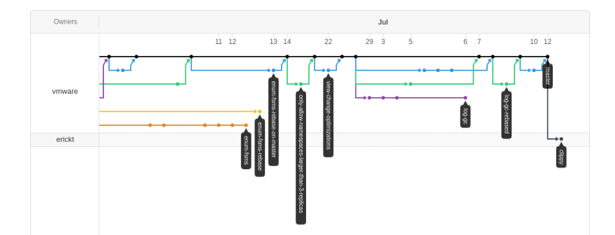

# 🌐 Three World


## 🗂 디렉토리 구조

```
.
└── server
    ├── bin
    ├── configs
    ├── controllers
    │   ├──
    │   ├──
    │   ├──
    │   ├──
    │   ├──
    │   ├──
    │   └──
    │
    ├── loaders
    ├── models
    ├── public
    ├── routes
    │   ├── index.js
    │   ├── mailbox.js
    │   └── user.js
    └── server.js
```

## 📖 프로젝트 사용 방법

1. 디렉토리 이동
   ```
   cd server
   ```

2. package.json에 정의된 패키지 설치
   ```
   npm i
   ```

3. `dotenv` 설정
   - `.env.sample`를 참고하여 `.env` 설정

<br>

4. 실행
   ```
   npm start
   npm run dev // dev
   ```

## 🌴 GIT LOG GRAPH
git tree를 rebase를 통해 잘 관리 했다면 넣어볼 만 할수도? (고려)


## 🔖 API 명세
