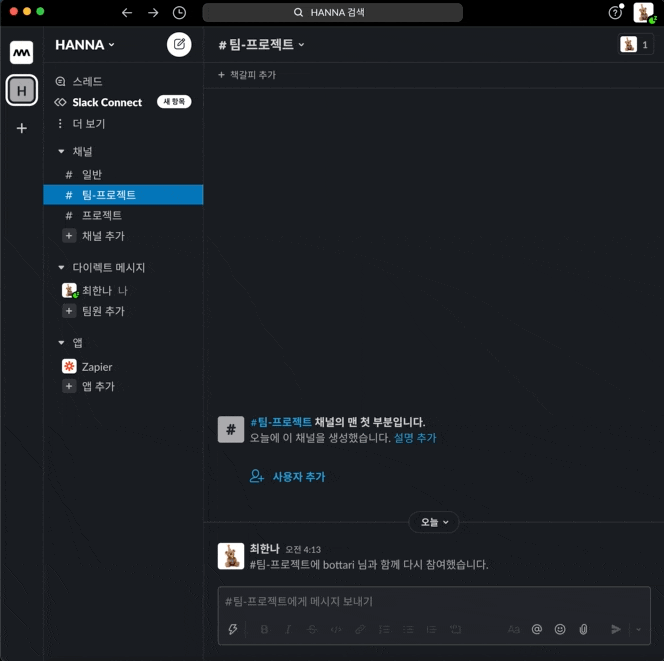
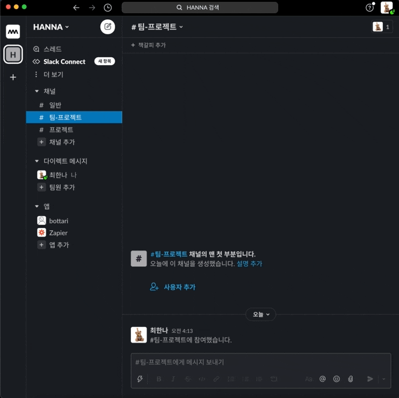
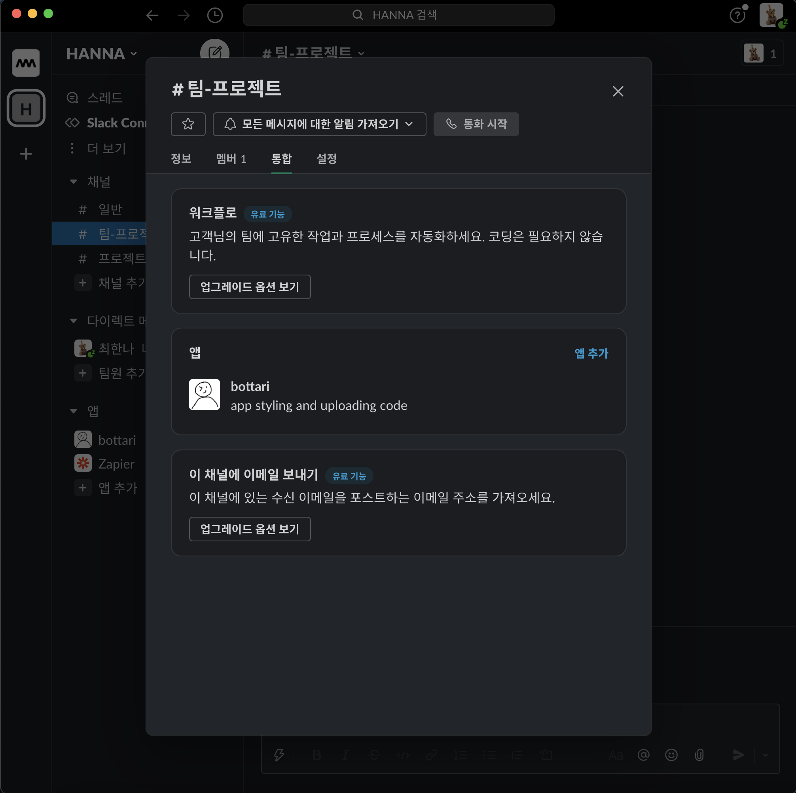
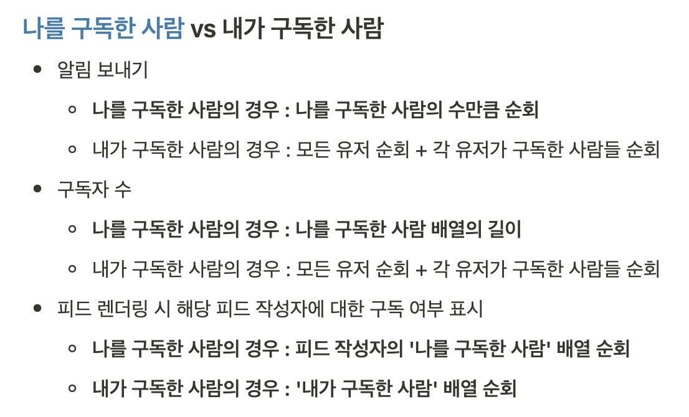

# bottari-server# 👜 Code Bottari

[](https://app.netlify.com/sites/bottari/deploys)

<a href="https://slack.com/oauth/v2/authorize?client_id=1809489527332.2456249374309&scope=channels:read,chat:write,chat:write.public,commands,files:write&user_scope="></a>

## 🔗 Repository
- **Client**: https://github.com/code-bottari/bottari-client
- **Server**: https://github.com/code-bottari/bottari-server

## 🪧 Content

- [bottari-server# 👜 Code Bottari](#bottari-server--code-bottari)
  - [🔗 Repository](#-repository)
  - [🪧 Content](#-content)
  - [🚪 Summary](#-summary)
  - [💡 Motivation](#-motivation)
  - [📆 Schedule](#-schedule)
    - [**1주차**](#1주차)
    - [**2주차**](#2주차)
    - [**3주차**](#3주차)
  - [🛠 Tech-Stack](#-tech-stack)
  - [📌 Feature](#-feature)
    - [**Slack App**](#slack-app)
    - [**Without Login**](#without-login)
    - [**With Login**](#with-login)
  - [💎 Experience](#-experience)
    - [**1. Task Card 작성**](#1-task-card-작성)
    - [**2. Schema 디자인**](#2-schema-디자인)
    - [**3. Git Branch 관리**](#3-git-branch-관리)
    - [**4. Slack 연동**](#4-slack-연동)
      - [**Slack App 개발의 시작**](#slack-app-개발의-시작)
      - [**공유 기능**](#공유-기능)
      - [**Slack App Directory에 등록 실패**](#slack-app-directory에-등록-실패)

## 🚪 Summary

자유롭게 **Code Snippet**를 게시하거나 **Slack**을 통해 공유하고 서로 소통할 수 있는 **커뮤니티형 웹 서비스**입니다.

## 💡 Motivation

- 팀원 모두 **커뮤니티형 서비스**에 흥미를 가지고 있었습니다.
  - "그렇다면 어떤 커뮤니티를 만들면 좋을까요?"
- **개발자를 위한 서비스**를 제공하고 싶었습니다.
  - "개발자라면 코드죠! 코드를 게시해서 서로 피드백을 주고받는 서비스를 제공해 봅시다!"
- 저희가 구현할 앱을 **외부 앱과 연동**함으로써 저희에게는 **도전의 기회**를, 사용자에게는 **새로운 사용자 경험**을 제공하고 싶었습니다.
  - "현업에서 대부분의 회사들이 사용하는 Slack 앱과 연동하여 커뮤니티 상의 코드를 Slack 앱으로 공유하는 기능을 추가하면 좋겠네요!"

## 📆 Schedule

전체 일정: 2021.08.30 ~ 2021.09.17

### **1주차**

: 2021.08.30 ~ 2021.09.05

- 아이디어 수집 및 검증
- 기술 스택 결정
- Mockup 작업
- KANBAN 생성
- Git Repository 생성

### **2주차**

: 2021.09.06 ~ 2021.09.12

- 개발

### **3주차**

: 2021.09.13 ~ 2021.09.17

- 개발
- 배포
- 리팩토링
- README 작성

## 🛠 Tech-Stack

**Language**

- ES6+

| Front-End                                                                                             | Back-End                                                                 |
| ----------------------------------------------------------------------------------------------------- | ------------------------------------------------------------------------ |
| • React <br /> • React-Query <br /> • Styled-Components <br /> • Prop-Types | • Node.js(Express) <br /> • MongoDB <br /> • Mongoose <br /> |

**Etc**

- React-Ace
- Firebase
- AWS-S3
- AWS-EC2
- ESLint
- Husky

## 📌 Feature

### **Slack App**
- Slack의 워크스페이스에 bottari 앱을 추가하여 Code를 전송할 수 있습니다.

  1. 워크스페이스에 bottari 앱 추가
    <p align="center"></p>

  2. 채널에 bottari 앱 추가
    - 앱 추가
      <p align="center"></p>

    - 앱 추가 완료
      <p align="center"></p>

  3. Code 전송
    <p align="center"></p>

### **Without Login**
- 메인 페이지에서 Code Snippet 미리보기 리스트를 확인할 수 있습니다.
  - Snippet은 10개 단위로 로딩되며, "더 보기" 버튼을 클릭하여 추가 목록을 불러올 수 있습니다.
  - Snippet 리스트를 언어 종류에 따라 분류할 수 있습니다.
  - 미리보기 Code Snippet을 클릭하여 상세 페이지로 이동할 수 있습니다.
- Hashtag 이름으로 Snippet을 검색할 수 있습니다.

### **With Login**
- 미리보기 Code Snippet을 클릭하여 상세 페이지로 이동할 수 있습니다.
  - Snippet을 Slack의 특정 워크스페이스로 공유할 수 있습니다.
  - Code 내용을 복사할 수 있습니다.
  - 해당 Snippet을 저장한 후 마이 페이지에서 확인할 수 있습니다.
  - 댓글 목록을 확인하고 새 댓글을 작성할 수 있습니다.
- 새로운 Code Snippet을 작성하고 게시할 수 있습니다.
- 다른 사용자를 구독할 수 있습니다.
- 다른 사용자의 Code Snippet을 "좋아요" 할 수 있습니다.
- 마이 페이지로 이동할 수 있습니다.
  - 내 정보를 수정할 수 있습니다.
  - 내가 작성한 & 저장한 Snippet 리스트를 확인할 수 있습니다.

## 💎 Experience

### **1. Task Card 작성**

총 **세 단계**에 걸쳐 Task Card를 작성하였습니다.

|                | 1차                                                         | 2차                                                       | 3차                                                   |
| -------------- | ----------------------------------------------------------- | --------------------------------------------------------- | ----------------------------------------------------- |
| 작성 방법      | 큰 기능 단위로 작성(기능 + UI)                              | 기능 구현 작업과 UI 구현 작업 분리                        | 기능을 더욱 잘게 쪼갠 후 UI 구현 작업과 분리하여 작성 |
| Task Card 개수 | 21개                                                        | 43개                                                      | 79개                                                  |
| 피드백 내용    | 각각의 Task 처리 작업에 소요되는 시간이 너무 길 것으로 예상 | 하나의 큰 기능을 구성하는 더 작은 기능 단위로 쪼개면 좋음 | -                                                     |

최종적으로 프로젝트 전체를 **작은 기능 단위**로 쪼갠 후 **기능 구현 작업과 UI 구현 작업을 분리**하여 작성한 **79개**의 Task Card를 기반으로 개발 작업을 시작했습니다. 이렇게 Task를 너무 작은 단위로 쪼개고 개발 작업을 진행했을 때 저희는 다음과 같은 문제를 겪었습니다.

- 기능 구현을 위해 반드시 처리되어야 하지만 누락되어 있던 Task Card가 갑작스럽게 추가되는 상황 발생
- Task 간의 의존도가 높아 어떤 Task가 delay되는 경우 그와 관련된 다른 작업까지 늦어지는 상황 발생

이를 통해 저희가 배운 사실은 다음과 같습니다.

- Task Card를 무조건 작은 기능 단위로 작성하기보다는 **프로젝트 기간과 참여 인원을 고려하여 그 크기를 적절하게 조절**해야 한다!
- **기능 구현 작업과 UI 구현 작업**을 분리하는 경우 두 Task는 서로 **의존도**가 생길 수밖에 없으므로 **분리하지 않는 것**이 좋다!

### **2. Schema 디자인**

Schema 디자인 시 가장 고민했던 부분은 **데이터 접근 패턴을 고려한 데이터 모델링 방법**입니다.

저희 프로젝트는 커뮤니티형 서비스라는 특성상 **많은 데이터가 서로를 참조**하기 때문에, 각 데이터의 **읽기/쓰기/갱신 비용을 비교**한 후 이를 저장할 가장 효율적인 위치를 찾아내야 했습니다. 이를 위해 저희는 **데이터의 저장 위치 및 접근 패턴을 고려**하여 발생할 수 있는 모든 상황에 대한 **시간 복잡도를 비교**했습니다.

예시)

<p align="center"></p>

### **3. Git Branch 관리**

**프로젝트 초반의 Git Flow: Feature Branch Workflow**

1. main 브랜치로부터 기능 단위의 feature 브랜치 분기
2. feature 브랜치 기능을 한 번 더 세부 기능으로 나누어 세부 기능 브랜치 분기(main/feature/detail)
3. detail 브랜치에서 작업 후 feature 브랜치에 merge
4. 최종적으로 main 브랜치에 merge

저희는 브랜치를 **기능별**로 생성하여 작업하는 **Feature Branch Workflow**를 Git Flow 모델로 선정하였고, 개발을 진행하면서 다음과 같은 어려움을 경험했습니다.

- main 브랜치에서 directory 구조 변경, package.json dependency 추가 및 세팅, common component 로직 수정 등의 작업을 수행함으로써 main 브랜치 오염
- feature 브랜치 분기 직전에 main 브랜치 최신화 과정을 거치지 않고 작업을 진행하여 추후 merge 시 발생할 conflict 규모가 커짐
- main 브랜치에서 feature 브랜치를 분기하지 않고 바로 세부 기능 브랜치를 분기하여 기능 관리가 제대로 이루어지지 않음
- feature 브랜치를 main 브랜치로 merge 할 때 관련 세부 기능 브랜치들을 한 번에 Pull Request(PR) 하기 위해 PR을 미루다 보니 그에 따라 merge도 늦어져 conflict 규모가 커짐

이를 개선하기 위해 저희가 적용한 방법은 다음과 같습니다.

- 기존에 main 브랜치에서 직접 수행하던 작업을 develop 브랜치에서 처리함으로써 main 브랜치 오염 방지
- 세부 기능 브랜치에서 작업 완료한 후 바로 PR 진행
- 브랜치 분기 직전에 최신화 진행

### **4. Slack 연동**

#### **Slack App 개발의 시작**

배포할 Slack App을 만들기 전에 테스트용 App으로 먼저 각 기능들이 구현 가능한지 판단한 후 실제 배포할 Slack App 작업을 시작했습니다. 그런데 작업 도중 Test App에서는 전혀 문제가 되지 않았던 부분에서 에러가 발생했고, Docs를 확인해봤지만 문제점을 찾지 못 했습니다.

로직상에는 문제가 없는 것으로 판단되었고, 고민 끝에 Slack API 라이브러리 GitHub Issue란에 문의를 남겼습니다. 답변 내용은 App Token에 문제가 있는 것으로 보이니 Token 테스트를 해보라는 것이었습니다. Token 테스트를 해보니 Token 자체에는 문제가 없었으나 배포를 하려는 App이 아닌 Test App의 Token을 사용하고 있었다는 사실이 확인되었고, Token을 변경하여 문제를 해결할 수 있었습니다.

차분히 하나씩 확인했다면 오래 걸리지 않고 쉽게 해결할 수 있는 문제였는데 사소한 부분을 놓쳐 시간이 지연됐다는 생각이 들어 큰 아쉬움을 느꼈습니다. 이 경험을 통해 예상치 못한 에러를 만나더라도 당황하지 않고 작은 것부터 하나씩 확인해보면 문제의 원인을 파악하고 해결할 수 있다는 사실을 배웠습니다.

#### **공유 기능**

커뮤니티상의 Code를 Slack 앱으로 공유하는 기능을 구현함에 있어, 처음에는 커뮤니티에 로그인된 계정과 연동된 Slack 계정의 워크스페이스 중 저희 Bottari App이 설치된 워크스페이스의 채널들을 선택하고 Slack 앱으로 바로 공유되는 방식으로 구현하고 싶었습니다. 하지만 Slack 로그인 기능을 구현하지 못 했고, 해당 기능 구현을 시도하는 데 생각보다 많은 시간이 소요되어서 일정이 예상보다 지체된 상황이었습니다.

남은 시간 안에 공유 기능을 구현하기 위해서는 방식을 변경해야 했고, 웹에서 공유 버튼을 클릭한 후 앱이 등록되어 있는 Slack 채널에서 ```/share [nickname]``` 형식으로 Slash Command를 입력하여 간접적으로 공유하는 방식을 적용했습니다. 보여지기에는 공유가 되는 듯한 느낌을 주었지만 완벽한 공유 기능을 구현해 내지 못 해서 아쉬움이 남았습니다.

기능 구현을 위한 시간 관리와 사전 조사의 중요성에 대해 크게 느꼈던 경험이었습니다.

#### **Slack App Directory에 등록 실패**

Bottari App을 배포한 후 Slack App Directory에서 검색을 해보니 저희 App이 검색 결과에 포함되지 않는 것을 확인할 수 있었습니다. 공식 링크를 통해 설치했고, 다른 계정으로 여러 워크스페이스에 정상적으로 설치되는 것을 확인했는데 App이 검색되지 않는다는 사실에 의문을 가지고 그 이유를 알아보았습니다.

확인 결과, App을 생성하는 것은 누구나 할 수 있지만 그 App을 App Directory에 등록하기 위해서는 Slack 측으로 제출한 후 검토 및 승인 절차를 거쳐야 한다는 사실을 알게 되었습니다. 등록 조건들을 확인해보니 저희 App은 수많은 조건들을 충족하지 못 해 App Directory에 등록할 수 없었습니다. 이 또한 저희 프로젝트에서 큰 아쉬움으로 남은 부분입니다.
