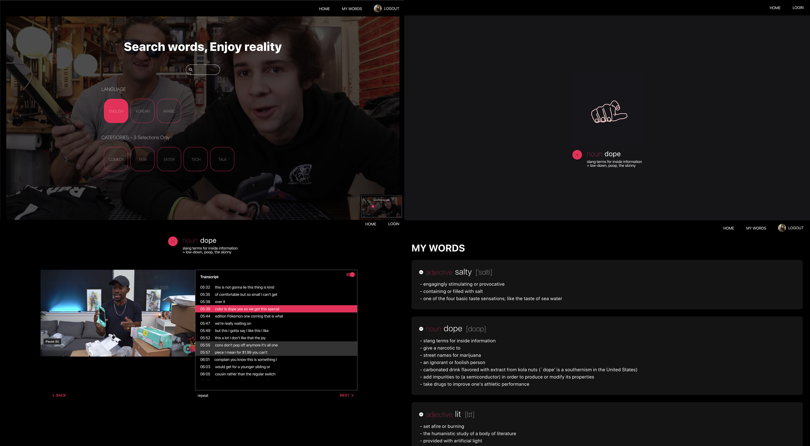

# getSample (Client and Server)

유튜브를 통해 원어민의 언어 사용례를 제공하는 어학 애플리케이션

- README English Version [[Link to English version]](https://github.com/letsdoyi/getSample-client/blob/master/README_Eng.md)
- 깃 이전 기록 모음 [[Link to Git Records]](https://github.com/letsdoyi/getSample-git-records)
- 데모 비디오 [[Link to demo video]](https://www.youtube.com/watch?v=OFxVRNepHiw)

### Screen Shots


### Searching


### Social Login and User Wordlists


## 주요 특징

- YouTube Data API를 이용한 언어, 카테고리별 영상 자막 검색
- YouTube iframe Player API, React Redux, Hooks을 이용한 Timed Text Transcript
- MongoDB Atlas를 이용한 사용자별 단어 리스트 관리(저장, 삭제 기능)
- Google Oauth와 Passport.js를 이용한 구글 소셜 로그인
- 클라이언트, 서버 배포(Netlify, AWS elastic-beanstalk) 및 자동화(CircleCI)
- Jest와 Enzyme을 사용한 Component, Reducer Unit 테스트
- Cypress를 사용한 End to End 테스트
- Git을 이용한 버전 관리

## 설치 전 필요한 선행 작업

Google OAuth 2.0 client ID를 발급 받아야 합니다.

- Go to the [Google API Console](https://console.developers.google.com/)
- Create OAuth 2.0 client ID [[how to link]](https://developers.google.com/identity/protocols/OAuth2)
- Copy and paste redirect url in google.json file codes
- Get `<YOUR CLIENT ID>` and `<YOUR CLIENT SECRETE>`

Google API Key를 발급 받아야 합니다.

- Go to the [Google API Console](https://console.developers.google.com/)
- Create API KEY [[how to link]](https://developers.google.com/identity/protocols/OAuth2)
- Get a `<YOUR GOOGLE API KEY>`

RapidAPI API Key를 발급 받아야 합니다.

- Go to the [RapidAPI](https://rapidapi.com/)
- Add new App
- Get an Application Key, `<YOUR X_RAPID API KEY>` in Security tab

MongoDB Connection URL을 발급 받아야 합니다.

- Go to the [MongoDB Atlas](https://cloud.mongodb.com/)
- Select Connect Your Application
- Get a Connection String URI, `<YOUR MONGO_DB CONNECTION URL>`

## 설치

- Github에서 Download 또는 clone 합니다.
- 환경변수(environment variables)를 설정합니다.
- 모듈들을 설치합니다.

```
// Server

git clone https://github.com/letsdoyi/getSample-Server.git

cd getSample-Server

touch .env
open .env // Copy and paste the code below in this file

cd..

npm install

npm run dev

cd..

// Client

git clone https://github.com/letsdoyi/getSample-Client.git

cd getSample-Client

npm install

npm start

```

### `.env`

```
MONGOOSE_URL = <YOUR MONGO_DB CONNECTION URL>
COOKIE_SESSION = <YOUR RANDOM STRING>
SESSION_SECRET = <YOUR RANDOM STRING>

X_RAPID_APIKEY = <YOUR X_RAPID API KEY>

GOOGLE_APIKEY = <YOUR GOOGLE API KEY>
GOOGLE_WEB_CLIENT_ID = <YOUR CLIENT ID>
GOOGLE_WEB_CLIENT_SECRET = <YOUR CLIENT SECRETE>
```

## 사용한 기술

### Client Side [[Client Side 링크]](https://github.com/letsdoyi/getSample-Client)

- JavaScript (ES2015+)

- 컴포넌트 기반 아키텍처를 위해 React 사용

- State 관리를 위해 Redux 사용

- Axios를 사용한 HTTP 요청

- Google YouTube Data API

- Google OAuth

- Sass, stylesheet

### Server Side [[Server Side 링크]](https://github.com/letsdoyi/getSample-Server)

- Node.js

- Express, Node.js web-application framework

- Mongo DB Atlas

- Mongoose, object data modeling library for Mongo DB Atlas

- Passport.js, authentication middleware node.js

- Proxy, for client-server integration

## Test

- Jest and Enzyme for Unit test

- Cypress, JavaScript End-to-End testing framework

## 배포와 배포 자동화
### Client:
- Netlify CI를 통한 배포 자동화
### Sever:
- AWS Elastic Beanstalk(AWS ELB)를 통한 서비스 배포
- CircleCI를 통한 배포 자동화

## 버전과 일정 관리

- Git, Github [[Previous Git Commit Records Link]](https://github.com/letsdoyi/getSample_git-records)

- Trello for managing scheluled tasks

## 챌린지

- 사용자 입력정보 받기(리액트, 리덕스): form와 checkbox 다루기

  Form Tag에서 입력 정보들을 submit 시켰을 때 입력된 정보들이 화면에서 모두 지워지는 점을 발견하였습니다. 이것을 해결하기 위해 submit 이벤트가 일어났을 때 입력값은 State로 저장하고 ev.preventDefault()로 정보 리셋을 막았습니다. 그 후 window의 history API를 통해 페이지를 이동시켰습니다.

  체크박스를 클릭하였을 때 화면에 바로 표시되지 않는 문제가 발생하였습니다. 그 이유는 사용자 입력 정보를 Store에 저장하여 State로 관리 하였기 때문에 계속 새롭게 입력 페이지가 렌더링 되면서 입력 정보가 화면에서 초기상태가 되었기 때문이라고 판단하였습니다. checkbox의 checked 설정에 state로 불리언 값을 가질 수 있도록 checked = {'en' === selected.language} 구문을 추가하여 해결하였습니다.

- 비디오 현재 재생 장면과 자막 싱크: 클로저 이용

  전체 자막 리스트에서 현재 재생 중인 장면의 자막을 강조하는 부분을 구현하는 것이 어려운 작업이였습니다. Youtube API를 통해서 가져온 각 자막 정보 종료 시간마다 현재 재생 시간을 State로 업데이트 시켰습니다. 그 후 다시 화면이 렌더링 될 때마다 클로저를 이용하여 현재 재생 시간이 자막 시작과 종료 시점 사이에 있을 경우 그 자막 블럭의 색을 변경하였습니다.

- 배포된 서비스에서 에러 발생, 여러 시도들

  배포 주소 https://getsample.letsdoyi.com/

  배포 후 video를 서버에 요청하고 응답을 받는 과정에서 504 Gateway Time-out과 CORS 에러가 발생하였습니다. 하지만 문제를 해결하기 위해 아래와 같은 시도들을 해보았습니다.

  - 문제 정의하기

    배포 후 발생한 문제이기 때문에 서버와 클라이언트 어느 부분에서 문제인지를 판단하기 위해 한쪽씩만 배포되지 않은 상태에서 실행하여 서버에서 문제가 발생했다고 판단했습니다.

    CORS 에러가 맞는지 정확히 판단하기 위해 서버의 CORS middle ware와 클라이언트의 proxy 설정을 점검하였습니다.
    이 과정에서 video가 아닌 User 정보, 사전 데이터를 가져오는 요청에서 CORS 에러가 발생하지 않는 것으로 보아 서버의 CORS 처리가 잘 이루어지고 있다고 판단하였습니다. (부가적으로 클라이언트의 proxy가 불필요하다는 사실을 알게 되었고 제거 하였습니다.)

    따라서,

    이 문제는 AWS ELB을 통해 배포된 서버에서 발생했고 CORS 에러가 아닌 504 Gateway Time-out 에러를 해결 해야한다고 판단하였습니다.

  - 문제 해결 방안 탐색

    AWS 공식 문서에 따르면, 504 Gateway Time-out의 원인으로는 애플리케이션이 설정된 idle timeout 보다 반응이 느리기 때문에 load balancer와의 연결이 끊어지기 때문이라는 사실을 알게 되었습니다.

    시도했던 방법들은 총 4가지가 있습니다.

    keep-alive timeout 설정을 활성화 하는 것, 애플리케이션의 수용력을 늘리거나 idle timeout 한도를 늘리는 것이 있었습니다. idle timeout을 60초에서 180초로 설정하였고 keep-alive timeout설정 또한 185초로 설정하였지만, 비디오 검색 60초 후 504에러가 발생하는 것으로 보아 설정이 적용되지 않은 것으로 판단 하였습니다.

    세번째 방법은 서버에서 비디오 정보를 가져오는 걸리는 시간을 줄이기 위해, 검색 범위를 비디오 한 개로 줄여보았지만 에러는 해결되지 않았습니다.

    마지막으로 시도한 방법은 서버에 요청하는 구조를 변경하여 시간을 줄이는 것이였습니다. 이전에는 클라이언트에서 검색 post요청을 보낸 후 다시 get요청을 보내 데이터를 받는 구조였지만, 서버에 요청을 한번만 보내는 것으로 변경하여 요청을 한번으로 줄였습니다. 이 과정에서 클라이언트와 서버의 불필요한 요청을 줄일 수 있었고, 서버의 에러 처리 이유를 이해할 수 있었습니다.


## 앞으로 개선하고 싶은 것들

- [ ] 배포 504 Gateway Time-out 에러 해결

- [ ] 강조된 자막으로 자동 스크롤 기능 추가

- [ ] 검색 속도 개선

- [ ] 검색 로직 개선

- [ ] 원하는 유투브 채널 등록 추가

- [ ] 컴포넌트 재사용을 위한 리팩토링
