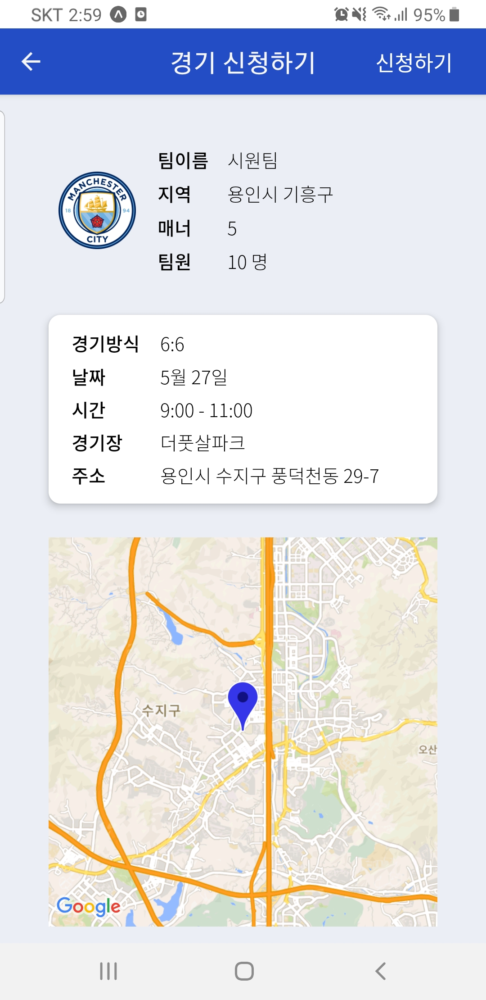
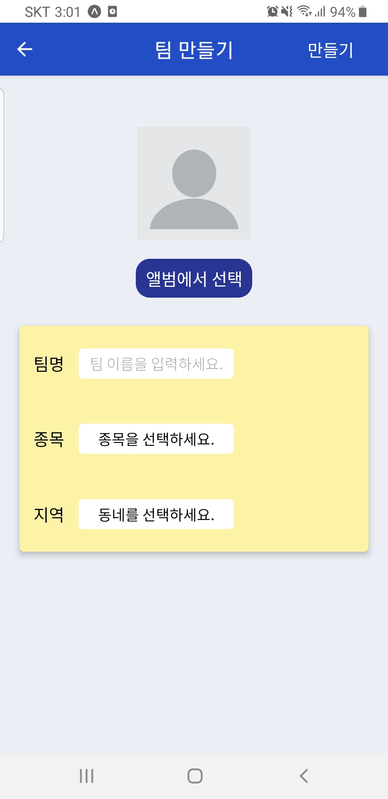

# **⚽️ 우리 동네 공놀이**
**우리 동네 공놀이**는 동네 주변의 축구, 야구, 농구 경기를 매칭시켜주는 앱입니다.

**📺 데모 영상**  
  

 

**📺 발표 영상**  

**🗃 Github Repository**  
- [Frontend](https://github.com/gongnori/gongnori-frontend)
- [Backend](https://github.com/gongnori/gongnori-backend)

 

## **🤔 Background**
평소 동네 친구들과 축구를 하는 게 취미인데, 매번 축구 카페에서 상대팀을 구하는 것이 번거로웠습니다. 이에 편하게 경기를 매칭해주는 서비스가 있으면 좋겠다고 생각하였습니다. 그래서 우리 동네에 있는 경기를 검색하거나 직접 경기를 만들어, 간단히 축구, 야구, 농구 경기를 매칭해주는 모바일 앱을 개발하게 되었습니다.

 

## **🗓 Schedule**
본 프로젝트는 2020.5.3 ~ 2020.5.21 3주 동안 진행 하였습니다.

`1주차` - 설계 단계
- 아이디어 검토 및 선정
- Figma 기반 Prototype Sketch [[링크]](https://www.figma.com/file/E4tlty1bRfJaxB3yPztwzk/Soccer?node-id=0%3A1)
- Lucid Chart 기반 Database Schema 설계 [[링크]](https://lucid.app/lucidchart/invitations/accept/inv_51c7d703-3af2-4f2d-bcb7-5a8c6c263722)
- 서버 endpoint 정의
- React Native (Expo) 개발환경 셋업

`2주차` - 구현 단계
- Tab / Stack Navigator 설계
- Tab / Stack 별 Screen 구현
- 클라이언트 요청 처리를 위한 API 서버 구축
- 우리 동네 경기장 검색을 위한 Google Map API 연동
- 경기 진행 협의를 위한 socket 기반 채팅 구현
- 이미지 저장을 위한 AWS S3 연동

`3주차` - 마무리 단계
- User Experience를 위한 상태 스크린 (Loading, Completion 등) 구현
- Redux 상태 구조 리팩토링
- MongoDB 스키마 업데이트
- 중복 코드, 최적화, 코드 스타일을 고려한 Frontend / Backend 리팩토링
- Frontend / Backend Test Code 작성

 

## **📝 Manual**
### **시작하기**

구글 로그인으로 앱을 사용할 수 있으며, 우리 동네 두 곳을 설정할 수 있습니다.

  

  

 
 

### **경기 신청하기**

해당 동네 / 종목 / 일자에 맞는 경기를 찾고 신청하기 버튼을 누르면, 상대팀과 채팅을 통해 경기 진행 여부를 결정할 수 있습니다.

  

  

  

  

 
 

### **경기 만들기**

해당 동네 / 종목 / 일자에 맞는 경기가 없다면, 주변 경기장을 검색하여 경기를 만들 수 있습니다.

  

  

 
 

### **팀 관리하기**

본인이 가입되어 있는 팀 정보를 볼 수 있으며, 또한 새로운 팀을 만들 수 있습니다.

  

  

 
 

### **랭킹전 참여하기**

랭킹경기를 만들고 다른 팀과 경쟁하여, 우리 팀의 순위를 알 수 있습니다.

  

  

 
 
 

## **👷🏻 Stack**
### **Frontend**
|Stack|Rationale|
|:-|:-|
|React Native|익숙한 React 문법으로, 모바일 애플리케이션 개발할 수 있기에 선정하였습니다.|
|Expo| React Native가 처음이기에, 러닝 커브가 낮은 Expo를 선정하였습니다.|
|Redux Thunk|Redux Store의 비동기 작업(서버 요청) 관리를 위해 사용하였습니다.|
|Socket.io-client|채팅을 위한 실시간 통신으로 사용하였습니다.|
|Google Map API|경기장 검색을 위해 사용하였습니다.|
|Jest|컴포넌트 및 함수 테스트를 위해 사용하였습니다.|
|Testing-libirary|컴포넌트 테스트(사용자 이벤트 / 렌더링)를 위해 사용하였습니다.|
|Mock service worker|서버 요청 테스트를 위해 사용하였습니다.|

 

### **Backend**
|Stack|Rationale|
|:-|:-|
|Nodejs|Javascript runtime이며, npm의 넓은 생태계 보유하고 있기에 사용하였습니다.|
|Express|일반적인 Nodejs 서버 애플리케이션이기에 사용하였습니다.|
|MongoDB|JSON형태의 다큐먼트를 사용하기에, NodeJS 기반 프로젝트와 호환성이 좋아 사용하였습니다. |
|Mongoose|일반적인 MongoDB ODM이기에 사용하였습니다.|
|Socket|채팅을 위한 실시간 통신으로 사용하였습니다.|
|Multer|S3에 이미지를 업로드하기 위해 사용하였습니다.|
|Amazon S3|팀 엠블럼을 전역적으로 접근하기 위해, 이미지 저장소로써 사용하였습니다.|
|Supertest|end point test(서버요청 모사)를 위해 사용하였습니다.|
|Chai|end point test(assertion)를 위해 사용하였습니다.|

 

## **🔎 Lesson**
이번 프로젝트를 기획할 때, 우리 동네에 있는 축구, 농구, 야구 경기를 매칭해주는 서비스를 개발하는 것 이외에도,<u>**React Native, customHook, 상태관리**</u>에 대해 학습하는 것을 목표로 하였습니다.  
목표 이외에도 프로젝트를 하며 겪은 경험을 통해, TDD의 중요성을 경험할 수 있었습니다.

 

### **React Native**
React와 유사하지만, Navigator에서 큰 차이점을 느낄 수 있었습니다. 모바일 애플리케이션은 브라우저에서 실행되는 것이 아니기 때문에 주소가 없으며, Navigator로 화면을 이동합니다. Navigator는 브라우저의 history 객체처럼 방문한 스크린들을 stack 구조로 구성합니다. **_따라서 React와 달리 React Native에서는 한번 방문한 페이지는 다른 페이지로 이동해도 unmount 되지 않는 차이점이 있습니다._** 이러한 컴포넌트 생명주기의 차이가 익숙하지 않아 상태 관리가 까다로웠습니다. 이에 사용자가 보던 화면이 유지되어야 하는지, 새로운 상태로 업데이트되어야 하는지 정의하고, 화면에서 사라지면 페이지를 unmount 시키는 unmountOnBlur 속성을 사용함으로써 원하는대로 상태를 관리할 수 있었습니다.  
**_이처럼 Navigator를 이해하고 애플리케이션을 개발하는 것이 React Native의 핵심이라 생각하였습니다._**

 

### **상태 관리**
본 프로젝트는 사용자 / 지역 / 경기종목 / 경기장 등 관리해야 할 상태가 많기에, 이들을 컴포넌트에서 props로 다루면 코드가 복잡도가 커집니다. 따라서 상태를 컴포넌트 밖에서 관리하고자 Redux를 사용하였습니다, 또한 실시간 서비스이기 때문에, 경기 만들기 / 경기 검색 / 경기 신청 등 서버 요청이 많습니다. 따라서 일반적인 Redux를 사용해도 되지만 컴포넌트에서 비동기(서버) 작업의 관심사 분리를 위해, Redux Thunk를 적용하였습니다. 이러한 Redux 기반 상태 관리는 개발 편리성을 제공하였지만, **_이번 프로젝트 처럼 많은 상태를 다뤄본 적은 없기에 어떤 상태를 Redux Store에 담을지, 어떻게 Reducer를 나눌지, 언제 서버에 요청해서 상태를 업데이트할지 정하는 것이 어려웠습니다._** 하지만 프로젝트 개발 기간 내내, 상태 하나하나에 고생하며 수차례 상태들을 리팩토링하니 아래 네 가지의 기준을 세울 수 있었습니다.  
1. 상태의 시간 변동성에 따라 서버요청을 정리
2. 상태의 전역성에 따라 Redux Store 정의
3. 비동기 작업은 컴포넌트 내부가 아닌 Redux Thunk로 관리
4. 요청 상태 (Loading / Completion / Error 등)은 Redux Store로 관리

위 기준이 정답이 아닐 수 있지만, 향후 개발을 하면서 기준의 성숙도를 높여 효율적인 상태 관리를 하고자 합니다.

 

### **Custom Hook**
이번 프로젝트를 하며, 컴포넌트 내에서 관심사를 분리하고 코드 재사용을 하고자 Custom Hook을 만들기 위해 노력하였습니다. **_예로 들어 useHeaderRight는 아래 그림과 같이 Stack Navigator 스크린 헤더 오른쪽에 버튼을 만드는 Custom Hook입니다._** 이 버튼을 클릭하면 스크린에 따라 팀 생성, 경기 생성, 경기 신청, 경기 진행의 서버 요청을 하게 됩니다. 이는 컴포넌트의 주요한 관심인 렌더링 작업과 거리가 멀고 여러 컴포넌트에서 사용되기 때문에, 별도의 Custom Hook으로 만들었습니다. 이전에는 간단한 Custom Hook을 만들어본 경험만 있었기에 관심사의 분리가 추상적으로 느껴졌지만, 이번 프로젝트에서 복잡한 로직을 담고 있는 Custom Hook을 만들어보니, 컴포넌트 코드가 View와 비동기 부분으로 분리되어 있다는 것을 몸소 느낄 수 있었습니다. 추후 React 기반 애플리케이션을 개발할 때, **_항상 Custom Hook을 만들 수 있을지에 대해 생각을 하여 재사용성, 관심사 분리가 되어 있는 코드를 작성하고자 합니다._**

  

  

  

  

 
 
 

### **Test**
요구사항대로 코드가 작동하는지 Test 하면서 개발하는 TDD(Test Driven Development)의 중요성에 대해 인지하고 있었지만, 처음 접하는 React Native에 대한 부담감과 TDD가 익숙하지 않았기 때문에 Test를 후 순위로 두고 개발을 시작하였습니다. 1차적인 개발을 마친 후, Frontend는 Testing Library와 Jest를 기반으로, Backend는 super test와 mocha를 기반으로 각각 Test를 하였습니다.  
Test를 하며 느낀 점은 컴포넌트가 컴포넌트 단위의 요구사항이 아닌, 애플리케이션 단위의 요구사항에 맞추어 코드가 작성되어 있다는 점이었습니다. 따라서 하나의 컴포넌트가 애플리케이션이 작동하는 데는 문제가 없지만 기능이 모호하여 다른 컴포넌트와 결합이 되는 경우가 더러 있었습니다. 예로 들어 A 컴포넌트에서 버튼을 클릭하여 상태를 바꾸면 B 컴포넌트에 바뀐 상태가 렌더링 되는 경우였습니다. 하지만 A, B를 감싸는 C 컴포넌트의 크기가 컸기에 테스트하기 어려웠습니다.  
이러한 점으로부터 **_Test가 만든 코드가 정상적으로 작동하는지에 대해 단순히 검증하는 것이 아닌, Test를 할 수 있는 컴포넌트를 설계함으로써 컴포넌트의 요구도, 독립성, 크기의 성숙도를 높인다는 것을 배울 수 있었습니다._**  
본 프로젝트를 통해 [Testing Library](https://minhob38.github.io/programming/testing-library-post/), [Redux Test](https://minhob38.github.io/programming/redux-test-post/) 등의 Test 기법에 대해 배울 수 있었으며, 항상 Test를 염두하고 개발을 하여, 단순히 실행되는 애플리케이션을 만드는 것이 아닌 유지, 보수가 용이한 애플리케이션을 만들어야 한다는 것을 느낄 수 있었습니다.

 
 

## **✏️ Conclusion**
이전에는 Javascript, React, MongoDB 등 단편적인 기술을 단계적으로 학습을 하다, 이번 프로젝트에서 처음으로 기획, 프론트엔드, 백엔드 개발 등 전체적인 과정을 혼자하니 익숙하지 않아 많이 헤맸습니다. 하지만 힘들었던 만큼 전체적인 프로세스를 경험하면서 조금이나마 요구사항 정의, 상태관리, 프론트-백엔드 연동 등 애플리케이션 설계에 대해 구체화할 수 있었습니다. 또한 기존에는 새로운 개념을 코드에 반영할 때 시간이 오래 걸렸지만, 이번 프로젝트는 정해진 시간 동안 혼자서 구현해야 했기 때문에 새로운 기술의 핵심 개념을 파악하고 빨리 적용할 수 있는 능력을 기를 수 있었습니다.

최종 결과물을 보니 개발자가 되기로 결정한 1년 전과 비교하여 많이 성장했다는 것을 느낄 수 있었습니다.
이처럼 부트캠프는 막연했던 개발자의 길에 조심스럽게 한발 내딛을 수 있게 해준 소중한 시간이었습니다. 옆에서 도움을 많이 준 동기, Ken님, 멘토님께 감사인사를 드립니다.🙂
