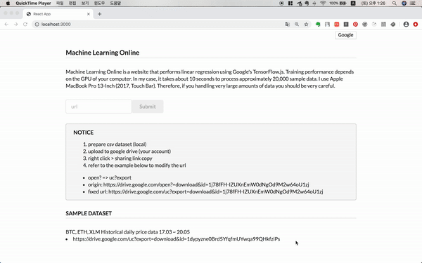

# Introduction
http://www.epoch.run/  .

  
Machine Learning Online 은 구글의 Tensorflow.js를 통해 머신러닝을 도와주는 웹사이트 입니다.
데이터를 csv 파일에 저장하고 구글 드라이브에 업로드 한 후, URL을 입력하면 간단한 linear regression 형태로 학습시킬 수 있습니다.

## Requirements

- csv 파일의 첫번째 행은 변수명 이어야 합니다.
- csv 파일은 첫번째 행을 제외하고는 숫자형 데이터 이어야 합니다.

## Feature

- 구글 소셜 로그인을 사용하면 입력한 데이터베이스 URL이 자동으로 저장 됩니다.
- 선형분석을 가정하며 모델의 형태는 y = ax + b 입니다.
- 분석하기를 원하는 y값 (label), x값 (features)을 선택할 수 있습니다.
- 학습에 사용한 데이터를 최대 200개까지 Scatter-plot 형태로 보여 줍니다.
- tfjs-vis 를 통해 모델이 훈련되는 과정을 시각화하여 보여 줍니다.
- Epoch, BatchSize, Sample size, Learning rate 등 모델 훈련 과정의 값들을 제공합니다.

## Specification

- ES2015
- MONGODB
- Express
- React
- Nodejs
- Axios
- Tensorflow.js
- Semantic UI React

## Test

- Jest와 Enzyme을 활용한 동작 테스트
- Cypress를 활용한 동작 테스트

## Deployment

- client: Netlify
- backend: Amazon Elastic Beanstalk

## Version Control

- Client, Backend git repo 구분

## Challenges

- 사용자 입력 URL을 읽어오는 과정에서 CORS 이슈가 있었는데, Nodejs로 우회하여 해결 하였습니다.
- Tensorflow.js 학습은 client, backend에서 모두 가능한데, 모델 학습 과정을 실시간으로 시각화 하기 위해 client 에서 학습을 진행 했습니다.
- Tensorflow.js 을 학습하는 과정에서 시행착오가 있었습니다. 학습모델 선택(Layers API, Core API)에서 실제 구현까지의 과정 등이 까다로웠습니다.

## Things to do

2주 동안 핵심기능(모델학습, 예측 값 산출) 완성에 초점을 두었습니다.
csv 데이터셋을 받을 때 문제 될 수 있는 경우의 수를 고려하지 못합니다.

- 데이터가 비어 있는 경우
- 데이터가 숫자 자료형이 아닌 경우
- 첫번째 행을 제공하지 않은 경우
- 카테고리 형 데이터 고려 X

Tensorflow.js 분석 중에서도 linear regression으로 한정했음에도 multivariate regression 구현이 되지 않았습니다.
