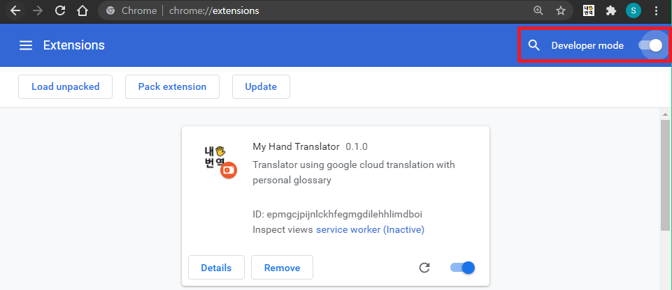
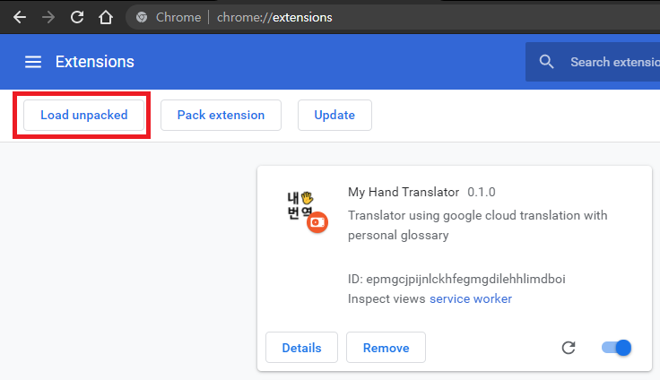
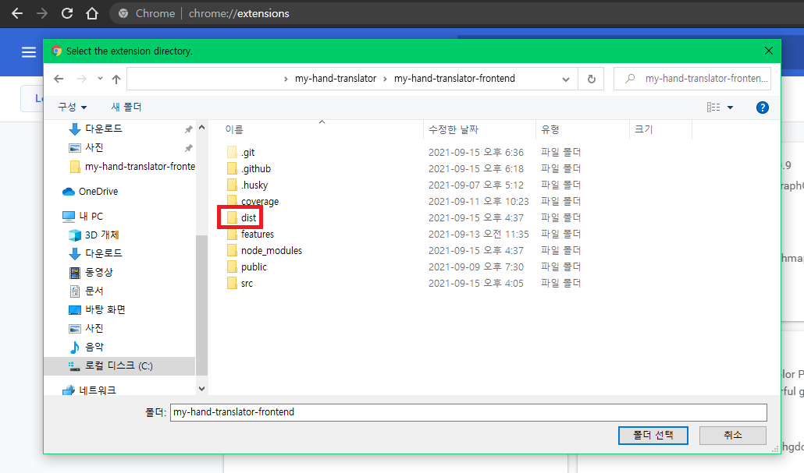

# Contributing to My Hand Translator

Welcome and thanks for your interest!  
Before submitting a pull request, please take a moment to review these guidelines.

## Reporting Issues

Found a problem? Want a new feature?

- See if your issue or idea has [already been reported].
- Provide a [reduced test case] or a live example.chrome://extensions/

Remember, a bug is a _demonstrable problem_ caused by _our_ code.

## Submitting Pull Requests

Pull requests are the greatest contributions, so be sure they are focused in
scope and avoid unrelated commits.

1. To begin: [fork this project], clone your fork, and add our upstream.

   ```bash
   # Clone your fork of the repo into the current directory
   https://github.com/[username]/my-hand-translator-frontend.git

   # Navigate to the newly cloned directory
   cd my-hand-translator-frontend

   # Assign the original repo to a remote called "upstream"
   git remote add upstream https://github.com/my-hand-translator/my-hand-translator-frontend.git

   # Install the tools necessary for testing
   npm install

   # Build source codes to make dist folder
   npm run build
   ```

## Testing your extension after building your project



- Go to `chrome://extensions/` (Please make sure you should use [Chrome Browser]!)
- Turn on `Developer Mode(개발자 모드)`



- Click top left `Load unpacked` same as `압축해제된 확장 프로그램을 로드합니다.`



- Select `dist` directory of your my-hand-translator-frontend directory
- And yes, you can show your chrome extension in `chrome://extensions/`!

2. Create a branch for your feature or fix:

   ```bash
   # Move into a new branch for your feature
   git checkout -b feature/thing
   ```

   ```bash
   # Move into a new branch for your fix
   git checkout -b fix/something
   ```

3. If your code passes all the tests, then push your feature branch:

   ```bash
   # Test current code
   npm test

   # Build current code
   npm run build
   ```

   > Note: ensure your version of Node is 14 or higher to run scripts

   ```bash
   # Push the branch for your new feature
   git push origin feature/thing
   ```

   ```bash
   # Or, push the branch for your update
   git push origin update/something
   ```

That’s it! Now [open a pull request] with a clear title and description.

[already been reported]: https://github.com/my-hand-translator/my-hand-translator-frontend/issues
[fork this project]: https://github.com/my-hand-translator/my-hand-translator-frontend/fork
[open a pull request]: https://help.github.com/articles/using-pull-requests/
[reduced test case]: https://css-tricks.com/reduced-test-cases/
[Chrome Browser]: https://www.google.co.kr/chrome/?brand=FKPE&gclid=Cj0KCQjws4aKBhDPARIsAIWH0JU5IMp8RhX3d7FIwXeMVPDN3DDs4NdMtnoPquQxghYWULLNVo2CctMaArPfEALw_wcB&gclsrc=aw.ds
