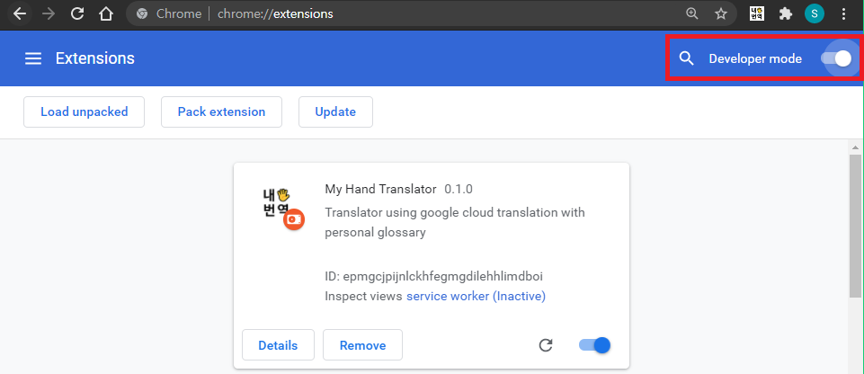
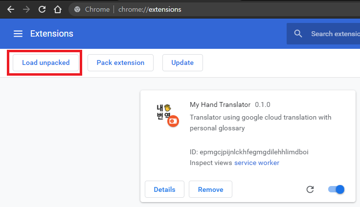
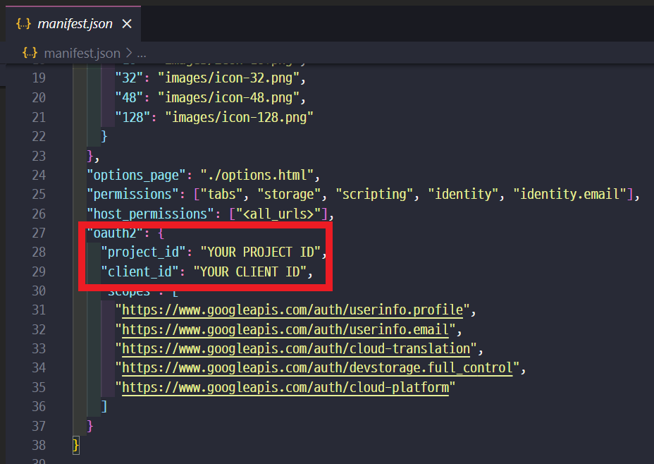

# 내손번역 My Hand Translator

https://user-images.githubusercontent.com/37020415/143677480-966a180d-df05-40a1-ae4e-ab43d4f1f74d.mp4

[내손번역](https://my-hand-translator.github.io/)은 자신만의 용어집으로 텍스트 번역을 할 수 있는 크롬 확장 프로그램입니다.
- [Google Cloud Translation API](https://cloud.google.com/translate/)를 사용하여 월 50만 자를 무료로 번역할 수 있습니다.  
- 확장 프로그램 안과 일반 웹페이지에서 영문을 번역할 수 있습니다.
- 나만의 용어집을 생성하고 편집할 수 있습니다.
- 자신의 최근 번역 기록을 조회할 수 있습니다.

프로젝트에 기여하길 원하시나요? [기여하기](./CONTRIBUTING.md) 문서를 참고해주세요!

## 설치 및 다운로드

### 1. 직접 빌드하여 설치하기

다운로드를 위해, 아래 명령어를 터미널에 입력해주세요.

#### 1.1. 클론하여 빌드하기

```shell
git clone https://github.com/my-hand-translator/my-hand-translator-extension.git
```

```shell
cd my-hand-translator-extension
npm install
```

```shell
npm run build
```

`my-hand-translator-extension` 디렉토리에 소스코드가 빌드된 dist 폴더가 생성됩니다.

#### 1.2. 크롬 브라우저에서 확장 프로그램 로드

크롬 브라우저를 열고 `chrome://extensions/`에 접속합니다.



우측 상단에 개발자 모드를 켭니다.



좌측 상단에 `압축 해제된 확장 프로그램을 로드합니다` 버튼을 클릭합니다.


이전 과정에서 생성된 dist 폴더를 선택합니다. My Hand translator(내손번역) 확장 프로그램이 설치될 것입니다.



[GET STARTED](https://my-hand-translator.github.io/#/get-started) 페이지를 참고해 본인의 구글 클라우드 플랫폼 프로젝트 아이디와 OAuth2 키를 dist 폴더 안에 있는 `manifest.json` 파일에 입력합니다.

다시 `chrome://extensions/`에서 확장 프로그램을 새로고침 합니다.

**📌만약 작동하지 않는다면, 크롬 브라우저에서 '프로필 동기화 사용'이 되어 있는지 확인해주세요!**

이제 정상적으로 사용할 수 있습니다.

더 많은 정보는 [홈페이지](https://my-hand-translator.github.io)에서 확인해주세요.

### 2. 크롬 스토어에서 다운로드(*deprecated)

[설치 링크](https://chrome.google.com/webstore/detail/my-hand-translator/iidfgdkckfjpabpfphlejemhoncclbdp)
 
> ⛔deprecated: 현재 OAuth 관련 이슈로 스토어에 배포된 버전은 사용할 수 없습니다.

## Contributors

[//]: contributor-faces

<a href="https://github.com/aidencoders"></a>
<a href="https://github.com/sounmind"></a>
<a href="https://github.com/jch1223"></a>

[//]: contributor-faces
