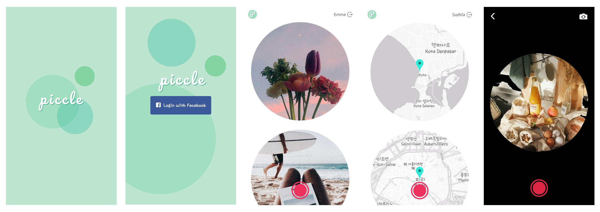

# [Piccle](https://play.google.com/store/apps/details?id=com.nashu.piccle&rdid=com.nashu.piccle)


## Introduction
Piccle은 익명의 사용자끼리 랜덤으로 사진을 교환하는 어플리케이션입니다.




## Content
- [Requirements](#Requirements)
- [Installation](#Installation)
- [Features](#Features)
- [Skills](#Skills)
- [Deployment](#Deployment)
- [Project Control](#Project-Control)
- [Version Control](#Version-Control)
- [Challenges](#Challenges)
- [Things To Do](#Things-To-Do)
- [Sincere Thanks](#Sincere-Thanks)


## Requirements
- Piccle은 안드로이드 기반 모바일 기기에서 사용할 수 있습니다.
- Piccle은 Facebook API를 사용했습니다.
- Facebook 가입이 선행되어야 합니다.


## Installation

### Client

```javascript
git clone https://github.com/choinashil/piccle-web.git
cd piccle-web
npm install
expo start
```

### Server

```javascript
git clone https://github.com/choinashil/piccle-server.git
cd piccle-server
npm install
npm start
```


## Features

- Facebook을 이용한 로그인 기능
- JSON Web Token Authentication
- 사용자 기기의 카메라, 위치 기능 사용
- 전/후면 카메라 토글 기능
- 사진 저장 및 사용자끼리 랜덤하게 사진과 위치정보 교환
- 리스트에서 사진 탭하면 지도로 변경


## Skills
### Client-Side

- ES2015+
- React Native
- Expo
- React Navigation
- React Native Gesture Handler


### Server-Side

- Node.js
- Express
- ES2015+
- JSON Web Token Authentication
- MongoDB
- Mongoose
- Atlas
- AWS S3


## Deployment

### Client

- Google Play Store를 통해 배포

### Server

- AWS Elastic Beanstalk를 통해 배포


## Project Control
- Git Branch 기반 개발 진행
- Trello를 이용한 Task Management


## Version Control

- Web, Server의 독립적인 관리를 위한 GIT Repo 구분


## Challenges

- React Native는 React와 비슷하면서도 달라서 새로운 내용 습득에 시간이 생각보다 많이 걸렸습니다. 이번 프로젝트에서는 기능 구현을 최소화해서 완성하는 데에 중점을 두었지만, 이후에 Native로 개발할 기회가 생긴다면 보다 다양한 기능을 구현해보고 싶습니다.
- 시간관계상 Android에 맞춰 개발 및 배포했는데, iOS와 Android를 동시에 개발할 수 있는 Native의 장점을 제대로 활용하지 못한 것 같은 아쉬움이 남습니다.


## Things To Do

2주라는 기간동안 기획부터 개발, 배포까지 처음 해보는 프로젝트이다보니 하루하루 스케줄대로 진행하여 기간 내 완성시키는 것에 중점을 두었습니다.

현재 기본적인 기능만 구현되어있어서 부가기능을 추가해보고 싶습니다.

- 사진 삭제 기능
- 사진, 지도 토글 시 flip animation 구현
- 상대방 사진 도착 시 push 알람 기능
- 리스트 페이지에서 화면 아래로 당겨서 새로고침 기능


## Sincere Thanks

[Ken Huh](https://github.com/Ken123777) / Vanilla Coding
