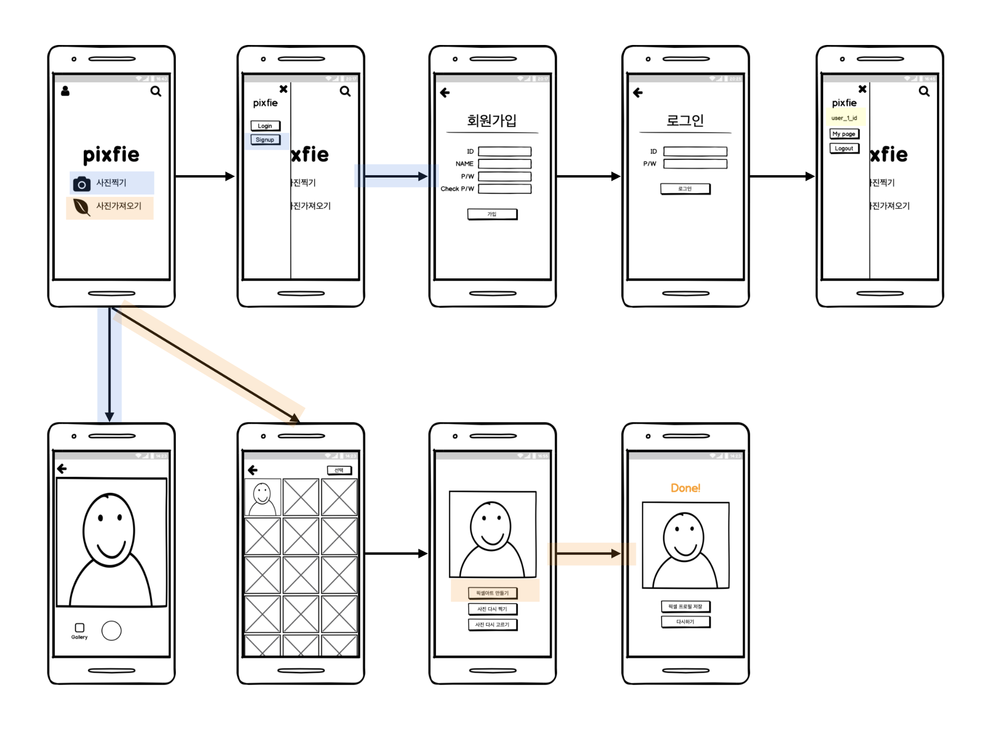
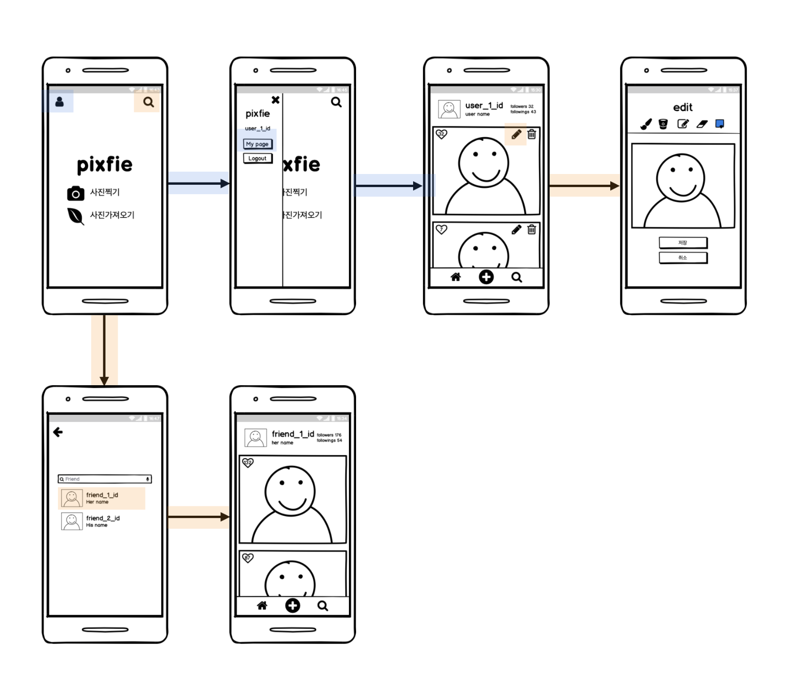

# pixfie

## Introduction

pixfie는 사진을 통한 얼굴 인식으로 개인 맞춤 픽셀 프로필 캐릭터를 만들어주는 안드로이드 어플리케이션입니다.

<br>

## Visuals


<br>

## Table of contents

- Description
- Requirement
- Installation
- Features
- Skills
- Deployment
- Challenges
- Things To Do

<br>

## Description

- 사용자 기기로 촬영한 사진 및 사용자 갤러리의 사진 사용
- 사용자의 얼굴을 인식해서 픽셀 프로필 캐릭터로 표현
- 로그인한 사용자의 페이지에 만들어진 픽셀 프로필 캐릭터 저장
- 다른 사용자의 페이지에 방문해서 팔로우 및 픽셀 프로필에 좋아요 표시 가능
- 저장된 캐릭터 수정 기능(생성된 얼굴 외의 머리, 옷 등)

<br>

## Mock Up

초기 구상한 Mock Up은 아래와 같습니다


1. 메인화면에서 drawer를 통해 login, signup 접근 -> signup -> login 후에 drawer에 회원 정보 출력
2. 메인 화면에서 사진찍기를 통해 카메라 앱 오픈 -> 사진 준비 페이지 -> 사진 완료 페이지
3. 메인 화면에서 사진가져오기를 통해 갤러리 오픈 -> 사진 준비 페이지 -> 사진 완료 페이지




1. 메인화면에서 drawer를 통해 로그인한 사용자의 마이페이지 접근 -> 마이페이지의 사용자 프로필 수정 버튼 -> 수정 페이지
2. 메인화면에서 돋보기를 통해 사용자 검색 -> 검색된 사용자 페이지 방문 가능



<br>

## Requirement

- 안드로이드 기기에서 사용 가능한 어플리케이션입니다
- Expo 앱을 설치하고 사용가능합니다

<br>

## Installation

- 아래 링크를 통해 expo앱에서 어플리케이션을 실행할 수 있습니다

  [pixfie](https://exp.host/@songjiyeon/frontend)
  
- 직접 실행해보기

  - 아래의 방법을 통해 android studio emulator에서 실행할 수 있습니다.

  ```git
  git clone https://github.com/SongJiyeon/pixfie-frontend.git
  cd pixfie-frontend
  npm install
  expo start
  ```

  

  - ❕서버는 AWS Elastic Beanstalk에 배포되어 클라이언트만으로도 실행이 가능합니다
  - ❕만약 서버를 실행하고 싶다면 여러가지 환경변수가 필요합니다. 아래의 파일을 생성하여 환경변수를 설정해주세요

  

  ```json
  /* .env */
  
  DB_HOST="db-host-url"
  AWS_ACCESS_KEY_ID="aws-access-key-id"
  AWS_SECRET_ACCESS_KEY="aws-secret-access-key"
  AWS_REGION="ap-northeast-2"
  AWS_BUCKET="aws-bucket"
  KAKAO_APP_KEY="kakao-app-key"
  TOKEN_SECRET_KEY="token-secret-key"
  BCRYPT_SALT_ROUNDS="bcrypt-salt-rounds"
  ```

  ```git
  git clone https://github.com/SongJiyeon/pixfie-backend.git
  cd pixfie-backend
  npm install
  npm start
  ```

<br>

## Features

- 로컬 로그인/회원가입 기능
- 사용자 기기에서 사진 촬영 및 선택 가능
- 사진 분석 api를 통해 face landmark 기반의 픽셀 프로필 캐릭터 생성

<br>

## Skills

#### develop

- Javascript ES6
- React를 사용하여 사용자 인터페이스 구현
- Expo를 사용하여 React 기반의 모바일 어플리케이션 구현
- Redux로 React에서 발생하는 상태를 저장
- Kakao Vision API를 통한 얼굴 인식
- Node.js를 이용한 서버 구현
- Express 웹 프레임워크로 API 작성
- jwt를 이용한 token기반 로컬 로그인 구현
- react-navigation을 활용한 모바일 앱 UI 관리
- react-native-canvas로 픽셀 이미지 구현

#### test

- Nodejs와 React 테스트를 위한 Jest 테스팅 프레임워크
- Enzyme 테스트 도구를 이용한 React Component 테스트

#### database

- MongoDB를 통한 data관리
- MongoDB 기반의 Node.js 전용 라이브러리 mongoose를 사용한 스키마 베이스 데이터 관리
- MongoDB Atlas로 클라우드 데이터 저장 및 관리
- AWS s3 클라우드 서비스를 이용하여 사용자 이미지 저장 및 url 생성

#### etc

- Notion.io 어플리케이션을 통해 troubleshooting, 기록과 task 관리

  [pixfie tasks](https://www.notion.so/ee05f074b8314e8795a12378fe991bc4?v=6ec27b789dbe42598ccff0f39834b08a)

<br>

## Deployment

- expo가 제공하는 `expo publish` 사용하여 클라이언트 배포
- AWS Elastic Beanstalk 서버 배포

<br>

## Challenges

- Fetch, axios 그리고 type

  개발 초기에 핸드폰으로 촬영하거나 갤러리에서 고른 사진이 서버로 넘어가지 않는 문제가 있었습니다.

  FormData를 사용해서 제대로된 사진을 넘겼다고 생각했는데 서버에서 받아온 데이터는 비어있었습니다.

  문제의 원인은 type이었습니다.

  

  fetch는 서버에 해가되는 잘못된 요청을 구분하기 위해 Header를 확인합니다.

  이 때, 받고자하는 data와 다른 data-type이 전달된다면 TypeError를 반환합니다.

  

  expo로 모바일 앱을 개발하고 있었기때문에 정확히 TypeError가 로그되는 것이 아니라 Network Fail Error가 발생해서 원인을 찾는 것이 더 오래걸렸습니다.

  form-data를 전달해야하고, 서버에서도 그렇게 받으려고 준비하고 있었는데 이미지 타입을 전달하고 있어서 TypeError가 발생했던 것 입니다. 그래서 데이터 타입을 `'multipart/form-data'` 로 바꾸자 문제가 바로 해결되었습니다.

  

  아래는 성공한 Image Fetch입니다

  ```javascript
  // Client
  const photo = {
    uri: photoUrl,
    name: 'new-photo.jpg',
    type: 'multipart/form-data',
  };
  
  const data = new FormData();
  data.append('photo', photo);
  
  axios.post(`${IP_ADDRESS}/api/users/${loggedIn.user._id}/photos`, data, {
    headers: {
      'Content-Type': 'multipart/form-data'
    }
  })
  .then(response => {
    setFaceType(generateFaceType(response.data));
    navigation.navigate('Edit', { portrait: null, mode: 'Result' });
  })
    .catch(error => {
    alert('얼굴 분석에 실패했습니다');
  });
  
  // Server
  router.post('/:_id/photos', upload.fields([{ name: 'photo'}]), async (req, res, next) => {
    try {
      const date = Date.now().toString();
  
      // 받아온 사진 정보 출력
      console.log(req.files.photo[0].buffer);
  
      res.json({ "result": "ok" });
    } catch (error) {
      next(error);
    }
  });
  ```

- ViewShot으로 캔버스 이미지 저장 ***내용 추가 필요***

  ViewShot은 `react-native-view-shot`으로 사용 가능한 component로 `<ViewShot>{chidren}</ViewShot>`으로 감싼 children을 캡쳐해서 이미지로 바꿔줍니다.

  어플리케이션 특성 상, 만들어진 픽셀 프로필 캐릭터를 개인이 활용하려면 이미지로 저장할 수 있어야하는데 `react-native-canvas` 는 웹의 `canvas` 와 달리 `save()` 메서드를 지원하지 않았습니다.

  그래서 찾은 해결책이 ViewShot Component였습니다.

  

  하지만 ViewShot도 그려지기 전, 비어있는 캔버스만 캡쳐하는 문제가 있었습니다.

  우선은 사용자 기기에 저장하지 않고 캔버스에 그려야하는 내용을 객체로 저장해서 마이페이지 캔버스에 그려주는 방식을 사용하였습니다.

  이 방법의 장점은 이미 캔버스이기때문에 사용자가 바로바로 수정이 가능하며, 용량이 큰 이미지파일을 따로 저장할 필요가 없다는 것 입니다. 하지만 어플리케이션의 성격과 맞지 않기때문에 이미지 저장 방법을 찾아서 보완할 예정입니다.

<br>

## Troubleshooting & FAQ

- 회원 검색의 실시간 반응

  회원 검색 시, 검색어와 결과가 실시간 반영되지 않는다

- 이미지 저장

  만들어진 프로필을 사용자 갤러리에 저장 -> 캔버스를 이미지로 저장할 수 있어야 함

- 로그아웃하고 마이페이지로 가면 데이터가 남아있는 에러 해결

- 다양한 얼굴 타입 추가

- 에러 처리

<br>

## Maintainers

- 송지연 (SongJiyeon) - https://github.com/SongJiyeon

<br>

<br>

Special thanks to [Ken Huh](https://github.com/Ken123777)

