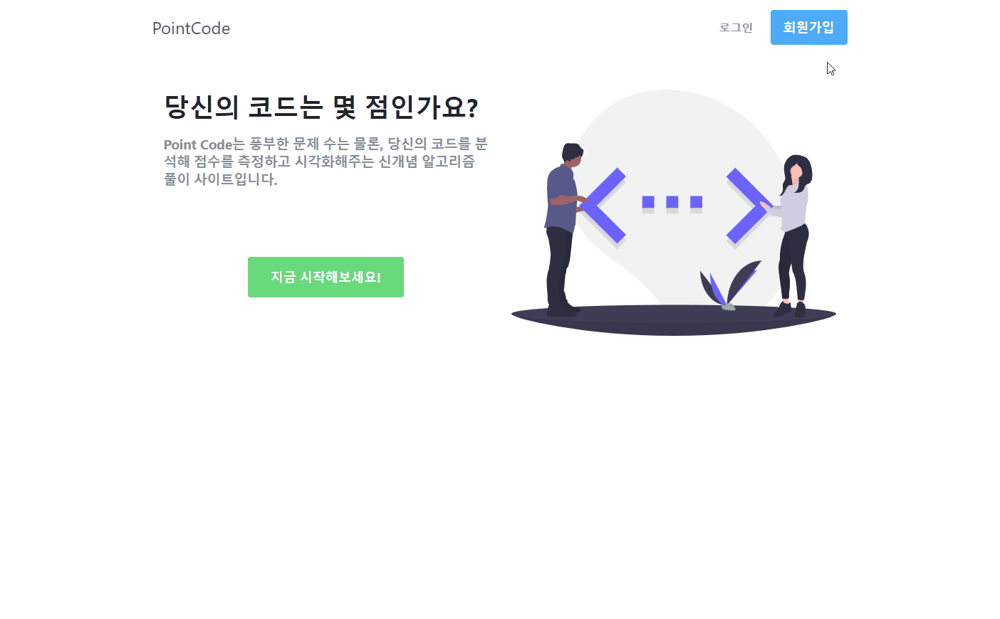

# Point Code

## Introduction


[Point Code](https://www.pointcode.site/)란 자바스크립트 알고리즘 풀이 사이트로, 자신이 제출한 코드를 eslint api를 통해 점수를 평가받을 수 있고, 제출했던 내역들을 시각적으로 확인할 수 있습니다.

## Motivation

### Why TypeScript?
1. 타입스크립트가 쓰이게 된 2014년 이래로 **사용률이 꾸준하게 증가**하고 있고, 바닐라코딩에서 가끔 뵙게 되는 프론트엔드 개발자분들도 대부분 회사에서 타입스크립트를 도입했단 정보를 듣게 되면서 관심을 가지게 됐습니다.
2. 자바스크립트 같은 경우 약타입 언어의 한계로 타입 추론이 불완전함에 따라 자동 완성이 잘 안되는 경우가 많은데 얼마 전에 [JSDoc에 관련된 글](https://medium.com/@trukrs/type-safe-javascript-with-jsdoc-7a2a63209b76)을 읽게 되었고, **자동완성은 물론 Type-safe하게 자바스크립트 코드를 작성할 수 있는 방법**을 알게 되면서 타입에 대해 더 공부해보고 싶어 프론트와 백 모두 타입스크립트를 도입하게 됐습니다.

### Why Algorithm Site?
첫 프로젝트는 **기본에 충실하면서 너무 흔하지 않은** 서비스의 웹사이트를 만들고 싶었고, 알고리즘 사이트가 기본적인 로그인 구현은 물론, 차트 같은 여러 기능들을 제공하는데 적합하다 판단했습니다.

## Features
- JWT 기반 일반 로그인
- 반응형 디자인
- 레벨별로 문제 선택 가능
- 코드 제출, 초기화
- VM2를 통해 문제 정답 확인
- ESLint API를 통해 점수 평가
- 문제별로 다른 유저들의 솔루션 확인 가능
- 모든 제출 결과 차트 제공
- 최근 일주일 제출 횟수 차트 제공

## Tech Stack

### Client
- TypeScript
- React
- React Router
- Redux
- Styled Components 
- Recharts
- CodeMirror
- Using Jest & React testing library for unit testing 
- Using Cypress for E2E testing

### Server
- TypeScript
- Node.js
- Express
- MongoDB with Atlas
- Mongoose
- ESLint API
- VM2
- JSON Web Token
- Using Jest for unit testing 

## Project Tool

### Version Control
- Git
- Github
 
### Mock-up
- [Oven](https://ovenapp.io/project/IeMjidGl2AdTSRj7qfU2Zmkp2JrMeejv#vH8eh)

### Schedule Management
- [Notion](https://www.notion.so/212d685dbeed435ab8a7a2f23689e93b?v=1ebb01a701944bb0968ee286febbc37c)

## Deployment

### Client
- Netlify

### Server
- Amazon Web Service Elastic Beanstalk
- Circle CI for continuous integration of source management

## Installation

### Client
```sh
$ git clone https://github.com/nikaidouuu/point-code_client.git
$ cd point-code_client
$ yarn install
$ yarn start
```

### Server
```sh
$ git clone https://github.com/nikaidouuu/point-code_server.git
$ cd point-code_server

# root 폴더에 .env 파일 생성 후 환경 변수 입력 
# PORT=8081
# SALT_ROUNDS=<YOUR_SALT_ROUNDS>
# MONGODB_ATLAS_URL=<YOUR_MONGODB_ATLAS_URL>
# COOKIE_SECRET_KEY=<YOUR_COOKIE_SECRET_KEY>
# JWT_SECRET_KEY=<YOUR_JWT_SECRET_KEY>

$ yarn install
$ yarn dev
```

## Challenges
- 개발 시간이 2주 정도 주어졌고, 프로젝트에서 처음 타입스크립트를 사용하게 되는 것이라 프로젝트 규모를 얼마만큼 잡아야 될지 고민이 많았는데 **우선 기본적인 기능을 충실히 구현하고 타입스크립트를 익히는 데 주안점**을 뒀고, 본래 기획했던 태스크 일정에 따라 진행할 수 있었습니다.
- 개발 환경에선 cra에서 제공하는 proxy 기능을 이용해 ajax 요청을 보냈는데, 프로덕션 환경에선 사용이 불가능하다고 하여 백엔드 서버에서 cors 라이브러리를 설치해 적용했는데도 오류가 발생했고, 원인을 찾아보니 **클라이언트에서 withCredentials란 옵션을 true로 설정하고 서버의 응답 헤더에서도 credentials와 origin을 true로 설정**해야 쿠키를 함께 보낼 수 있었습니다. 또한 **exposedHeaders에서 응답할 custom header 이름**들을 적어줘야 custom header들이 정상적으로 응답이 된다는 것을 배웠습니다.

## References

### Basic
- [타입스크립트 공식 문서](https://typescript-kr.github.io/pages/Basic%20Types.html)
- [타입스크립트 딥다이브](https://typescript-jp.gitbook.io/deep-dive/getting-started)
- [유틸리티 타입](https://medium.com/harrythegreat/typescript-%EC%9C%A0%ED%8B%B8%EB%A6%AC%ED%8B%B0-%ED%81%B4%EB%9E%98%EC%8A%A4-%ED%8C%8C%ED%97%A4%EC%B9%98%EA%B8%B0-7ae8a786fb20)

### Frontend
- [리액트 + 타입스크립트 깃북](https://react.vlpt.us/using-typescript/)
  
### Backend
- [Mongoose + Typescript Docs](https://github.com/DefinitelyTyped/DefinitelyTyped/tree/master/types/mongoose)
- [Complete guide for Typescript with Mongoose for Node.js](https://medium.com/@agentwhs/complete-guide-for-typescript-for-mongoose-for-node-js-8cc0a7e470c1)
