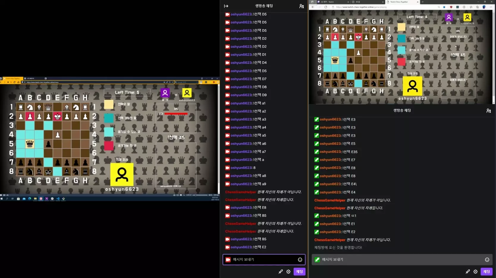

<h1 align="center">
  TWITCH-CHESS-TOGETHER
</h1>

  

  
  
  
  

## DESCRIPTION

TWITCH-CHESS-TOGETHER은 트위치 채팅으로 진행할 수 있는 체스 게임 사이트 입니다.
TWITCH 스트리머 두명이 접속하여, 트위치 스트리머들의 시청자들간에 체스를 통하여 경쟁을 할 수 있습니다.

## MOTIVATION

옛날에 TWITCH 에서 유행하던 TWITCH POCKETMON 이라는 형태의 방송 포맷으로부터 영감을 얻었습니다.
TWTICH POKETMON이라는 방송 포맷은 시청자들이 게임을 조작 가능한 커맨드를 채팅창에 입력하면 그 커맨드가 그대로 게임에 적용되어 게임을 진행시는 형태의 시청자 참여 방송입니다.
저는 이런 방송이 시청자들간에 협력을 하여 그저 게임을 클리어하는게 아닌 다른 방의 시청자들과의 경쟁을 할 수 있다면 좋을 것 같다라는 생각으로 이 사이트를 기획하게 되었습니다.

## USAGE

1. 트위치 방송이 켜져있는 상태에서 https://www.twitch-chess-together.online 에 접속
2. 게임 방 생성 후, 누군가 입장시 게임 진행
3. 게임 진행은 트위치 채팅을 이용

## TECH STACK

FRONTEND: REACT / SOCKET-IO-CLIENT / REDUX / REDUX-SAGA / STYLED-COMPONENTS

BACKEND

- LOGIN & GAME DATA SERVER: EXPRESS / MONGODB
- IN-GAME SERVER: EXPRESS / SOCKET-IO

## FEATURE

⚠️ 영상에 보이는 사이트들은 트위치 방송에서 송출되고 있는것이기 때문에 딜레이가 있습니다.⚠️

 

1. 게임 생성 & 참가
    

 

2. 실시간으로 입력된 게임 진행용 채팅 보여주기 & 채팅 갯수 비교용 차트

 

 

3. 게임 진행

 

 

4. 게임 종료

 

## CHALLENGE

### FRONTEND

1. REDUX-SAGA 를 사용하여 SOCKET 서버와 연결하는 로직을 구성할 때, 몇가지 필수 기능을 잡아두고 구성하려했습니다.
   첫번째, 서버가 켜지기 전까지는 서버 종료, 서버로부터 이벤트를 받는 행위를 불가능.
   두번쨰, 서버가 켜진 상태에서 다시 서버와 연결하는 행위는 불가능.
   세번째, 서버가 켜지고 서버와의 연결이 끈어지더라도 다시 서버와의 재연결이 가능.
   이렇게 세가지 조건을 만족시키도록 로직을 구성했어야했지만, 이번에 REDUX-SAGA를 처음 사용해보며 GENERATOR를 처음 써서 그런지 GENERATOR를 이용한 로직을 짜기 힘들었습니다. 개인적으로 세번째 조건을 만족시키는 것이 굉장히 힘들었는데, 세번째 조건은 while(true)로 첫번째, 두번째 조건을 만족하는 로직을 감싸는 것으로 해결하였습니다. 굉장히 간단한 해결법이였지만, while(true)를 이런 형태로 쓴다는 구상을 하기가 힘들었습니다.

2. REACT를 사용하여 게임을 개발하다보니, 상태에 따라서 화면이 원하는 화면까지 변경이 되는 과정 사이에 불필요한 렌더링이 생기는 문제가 생겼었습니다. 개발하기 전에는 생각하지 못했였지만 결국 setState를 사용하여 내부 state를 변경 시키면 다음 렌더링때 변경이 되고 다시 그 변경된 값으로 인하여 다른 값들의 변경이 이루어지기 때문에 모든 로직을 한번에 변경시킬 수 있게 로직을 바꾸는 것으로 문제를 해결하였습니다.

### BACKEND

1. 이번에 OAUTH 로그인 기능을 만들며 PASSPORT 나 FIREBASE의 도움을 받지않고 처음만들었는데, OAUTH 로그인 페이지에서 로그인을 통해 ACESSTOKEN 을 로그인 서버로 보내준 뒤, 그 ACESSTOKEN 과 유저 정보들을 포함하여 로그인 다음 페이지로 이동시키는데 어려움이 좀 있었습니다. TWITCH를 통한 로그인이 끝나고 메인 화면으로 이동을 하기 위해서 EXPRESS에서 REDIRECT를 사용했는데,
   REDIRECT를 하며 데이터를 보내는것이 쉽지않았고 그 보낸 데이터를 클라이언트에서 어떻게 가져와 활용하는지도 문제였습니다. 여러가지 방법을 찾아보았지만 결국 데이터를 쿠키에 담아서 보내는 방법밖에 찾지 못하여 쿠키로 데이터들을 넘겨주었고, 그 쿠키들을 다시 서버로 보낸 뒤 데이터를 다시 클라이언트로 보내주는 방식으로 해결을 하였습니다.

## PROJECT REVIEW

1. REDUX를 사용시에는 공식문서에서 REDUX-TOOLKIT 사용을 권장했기에 사용했지만, REDUX-SAGA와는 잘 맞지 않는 느낌이 들었습니다. 제가 사용한 폴더의 구조 자체가 REDUX-SAGA와 어울리지 안았을 가능성도 있지만, 결국 다른 좋은 폴더 구조를 생각하지 못했기에 약간의 혼란을 겪었습니다.

2. 기획단계에서 실시간 게임 데이터의 관리를 서버에서 할 생각을 하지 못했던 것에 굉장히 큰 아쉬움이 남습니다. 현재 만들어진 결과물에서는 게임 데이터는 오직 클라이언트에서만 관리가 되고, 게임 서버는 게임 데이터의 변경만을 주고 받기 때문에 게임 내부 데이터의 변조를 막는 것을 포기할 수 밖에 없었습니다.

3. 프로젝트를 진행하며, 초기의 개발 방향에대해서는 초기 기획을 다 따라갔지만 점점 진행하다보니 개발 후반부에서는 전체적인 기획의 방향은 따라가도 세부적인 부분까지는 초기 기획을 따라가는 것이 어려웠고 관리해야할 코드가 많아지다보니 개발 속도가 3~4배는 느려지는 것이 느껴졌습니다. 여러가지 프로젝트를 해보면서, 기획의 중요성에 대해서 느껴왔지만 이번 프로젝트를 하면서 초기 기획에서의 결점이 규모의 프로젝트의 얼마나 큰 영향을 줄 수 있다는 지 깨달았습니다.
