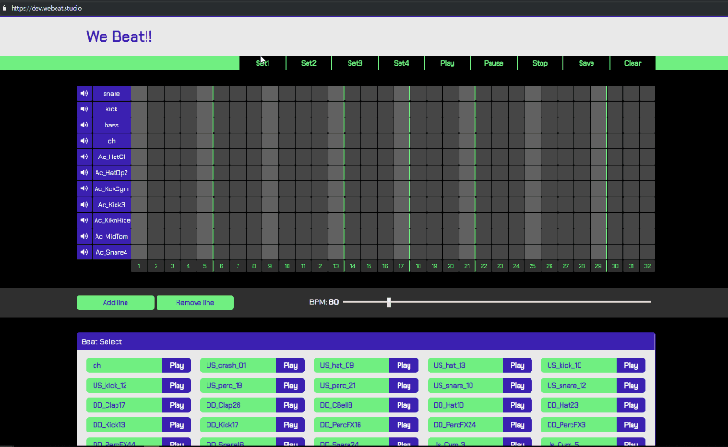

# [WE BEAT!!](https://www.webeat.studio)

# Introduction

**WE BEAT**는 평소 관심 있던 음악제작용 [시퀀서](https://ko.wikipedia.org/wiki/%EC%8B%9C%ED%80%80%EC%84%9C)를 웹용으로 만든 애플리케이션입니다. \
자신의 비트 파일을 올려 악보에 사용하고, 사용자가 만든 비트를 공유하거나 서로의 비트를 수정하는 기능에 집중하여 구현한 웹용 비트메이커입니다.



[Youtube Link](https://www.youtube.com/watch?v=YjONTV1yyQs)

## Requirements

- WEBEAT은 Chrome Browser를 권장합니다.
- WEBEAT은 firebase Storage와 Database를 사용합니다.

## Installation

### Client

```
git clone https://github.com/ddody/we-beat.git
cd we-beat
npm install
npm start
```

## Feature

- 루프가 돌며 선택한 노트에 해당 비트 음원 재생
- 사용자끼리 자신의 비트를 공유하거나 서로의 비트를 수정
- Tone.js이용하여 32마디의 루프 반복, 해당하는 비트 재생 구현
- 사용자가 만든 비트 악보를 저장하고 악보 URL 공유
- 본인만의 비트 파일 업로드 하여 이용
- 반응형 및 모바일 가능
- 피치 조절, 음소거, 재생, 정지 등 기능 구현

## Specification

- ES2015
- Firebase Storage, Database
- React
- Redux
- React Router
- CSS Module, Sass
- Tone.js

## Test

- Jest와 Enzyme를 이용하여 Reducer 및 Component 단위 테스트 구현

## Deployment

- Netlify 서비스를 이용하여 client 배포 및 테스트 자동화

## Version Control

- Web, Server의 독립적인 관리를 위한 GIT Repo 구분

## Challenges

- 음악 API를 다뤄 보는 것은 처음이라 Tone.js API 사용하기가 쉽지 않았습니다. 하지만 굉장히 유용한 API라는 것을 알았고 관련 작업을 할 때 더 효과적으로 사용하고 싶습니다.
- Storage 사용 시 사용량에 신경을 써야 한다는 것을 알게 되었습니다. 항상 저장소를 사용하는 프로젝트에는 정확한 사용량을 토대로 기획을 세워야 한다는 것을 알게 되었습니다.
- 처음 비트 파일이 재생될 때마다 저장소에 접근하였던 것을 axios를 이용 blob 형태로 받아와 크라이언트상에 저장하여 이용하였습니다.
수정 후 저장소 사용량의 정확한 데이터분석은 어렵지만, 음원 로딩속도 면에서 월등히 빠른 현상을 보였습니다.

## Things to do

개인 프로젝트이지만 2주라는 기한을 정하고 시작하였기 때문에 초기기획에 따른 완성에 초점을 두었습니다. \
평소에 흥미가 있었던 주제라 즐겁게 작업하였습니다.
하지만 초반 음악 API 선택 미스와 기능 추가에 대한 욕심 등 아쉬움도 많이 남은 프로젝트였습니다. \
보완점은 문서로 남기고 지속적인 수정으로 더 단단한 서비스로 완성하려 합니다.

- 비트 루프 시 박자 나누기
- 사용자 등록 기능 추가
- 등록된 사용자별 비트 저장 기능
- 비트 음원 종류별 분류
- BPM range 변경
- 모바일 기능 보충
- 그 밖에 디자인 수정 및 기능 추가

---
Special thanks to [Ken Huh](https://github.com/Ken123777)
