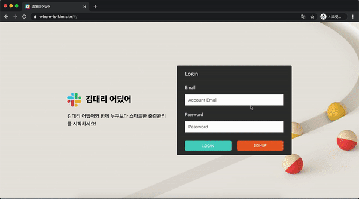

# Where is Kim



[https://www.where-is-kim.site](https://www.where-is-kim.site/#/)

## Introduction

`김대리 어딨어` 는 사내 출결 관리 어플리케이션입니다. 회사의 관리자 입장에서 직원들의 출결을 쉽게 관리할 수 없을까? 라는 생각으로 접근하였고 전 직장에서의 경험을 바탕으로 기능들을 기획/구현하게 되었습니다.

## Requirements

- 회원가입시 Email은 메일 수신이 가능한 메일 주소여야만 원활한 사용이 가능합니다.
- 해당 웹 어플리케이션은 모바일을 위한 UI는 지원하지 않습니다.
- 브라우저는 최신 크롬 브라우저 사용을 권장합니다.

## Installation

```
git clone https://github.com/marco0212/where-is-kim-frontend.git
cd where-is-kim-frontend
npm install (or yarn)
npm start (or yarn)
```

## Usage

1. 팀 생성 및 참가를 위해 회원가입/로그인합니다.
2. 팀을 생성합니다. (함께 사용할 팀원이 있다면 팀원을 초대합니다.)
3. 관리자를 포함한 팀원은 Record 페이지의 출/퇴근 버튼을 클릭해서 출결 관리를 시작합니다.

## Features

- 웹 소켓을 활용한 실시간 출퇴근 포스팅, 현재 사이트 접속 상태 업데이트
- 메일링과 JWT를 활용한 팀원 초대 및 팀원 인증
- 팀 구성원 출퇴근 기록 분석 및 시각화
  - 누적 직원별 지각 횟수
  - 금주 가장 많은 지각을 한 직원
  - 금주 팀원별 근무시간
  - 누적 요일별 지각 횟수 분석
- 팀원 권한 설정(Admin, Member)
- Thread별 좋아요 및 댓글
- 팀 생성, 회원가입
- JWT를 활용한 토큰 기반의 Local 로그인

## Skills

### Client Side

- ES2015+
- React
- Redux
- SocketIO Client
- React Router
- Redux Thunks
- Redux Persist
- Chart.js
- Moment.js
- Styled Components


### Server Side

- Express
- AWS Elastic Beanstalk
- AWS Certificate Manager
- AWS S3
- Mongoose
- Atlas
- Jsonwebtoken
- Moment.js
- Multer / Multer s3
- Nodemailer
- Passport
- SocketIO

## Challenge

- 프로젝트 개발 초기 Token을 활용한 인증을 이해하고 구현하는 것에 어려움을 겪어 많은 시간을 사용해야 했습니다. Session 형태의 로그인에 비해 이해해야 할 것들이 많아 구현하기 까다로웠습니다. 이를 해결하기 위해 먼저 Token을 활용한 인증 처리 프로세스를 이해해야 했고 Passport에서 JWT를 어떻게 다뤄야 하는지 문서를 반복해서 읽어야 했습니다. 결국 계획했던 일정 시간은 초과됐고 이틀 만에 인증 작업을 마칠 수 있었지만 혼자서 해결한 것에 대해 보람을 느꼈고 자신감있는 상태로 다음 작업에 임할 수 있었습니다.
- 많은 개발자들이 React의 이점으로 재사용성을 이야기하지만 제가 만든 컴포넌트들은 대부분 특정 상황에만 사용할 수 있는 1회성 컴포넌트였습니다. 저는 이번 프로젝트에서 재사용을 기대하며 기존의 방식을 탈피하고 철처하게 뷰 로직 컴포넌트와(Presentation)과 비지니스 로직 컴포넌트(Container)를 구분해서 작업했습니다. 익숙하지 않은 방식이다보니 작업이 평소보다 느리게 진행되었고 항상 모험을 하고 있는 기분이 들어서 불안했습니다. 하지만 어플리케이션의 스케일이 조금씩 커지고 기존의 컴포넌트를 다시 사용할 일이 생기자 이렇게 나눈 것의 이점이 체감되기 시작했습니다. 보여지는 컴포넌트와 이를 활용한 컴포넌트로 나눈 것으로 인해 재사용성의 유연함뿐 아니라 관심사의 분리를 통해 일관된 코드를 만들 수 있었고 좋은 유지보수성도 취할 수 있었습니다.

***참고 자료***
- [https://medium.com/@learnreact/container-components-c0e67432e005](https://medium.com/@learnreact/container-components-c0e67432e005)
- [https://www.youtube.com/watch?v=KYzlpRvWZ6c&t=1351](https://www.youtube.com/watch?v=KYzlpRvWZ6c&t=1351)

## Things to do

- 기존의 구상은 출퇴근 버튼 클릭시 회사의 위치와 현재 내 위치를 비교해서 근접 거리로 판단될 때 출/퇴근 버튼이 활성화되도록 구현할 예정이었습니다. 빠른 시일 내에 추가 보완할 예정입니다.
- 처음 마운트될 때 DB에 저장되어 있는 모든 Thread를 불러 화면에 채우고 있습니다. 기록이 많을 경우를 대비해 서버에서 호출 데이터 갯수를 조정할 수 있도록 API를 수정하고 프론트에서는 무한 스크롤 방식으로 구현하는 것이 더 적합하다고 생각합니다.
- 팀 생성시 현재 좌표를 등록할 수 있도록 구현했지만 실제 불러온 좌표는 현재 좌표의 근사치이거나 부정확한 경우가 많았습니다. 이를 위해 주소를 입력하면 해당 주소에 따른 좌표값을 반환하거나 지도에 직접 마커를 찍어 좌표를 얻을 수 있는 기능이 추가해 보완할 수 있을거라고 생각합니다.