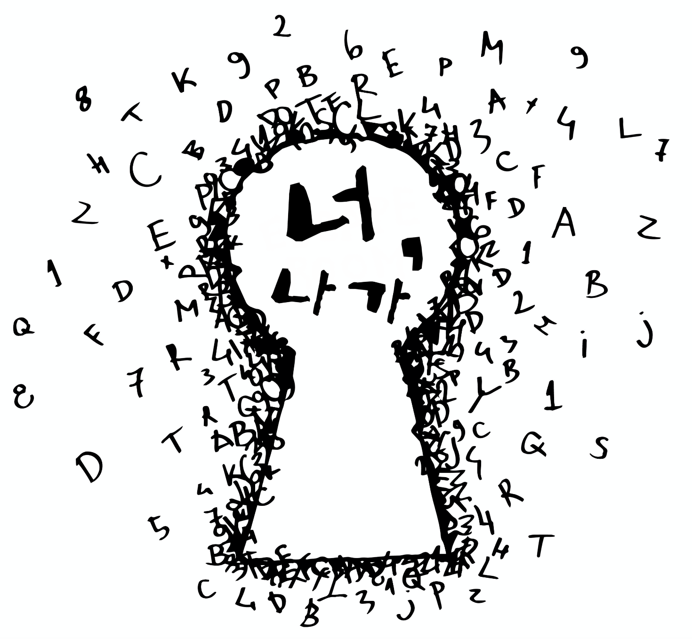
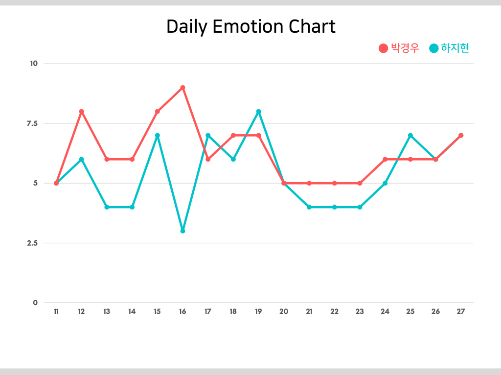

# YOU OUT! (너, 나가!)
---


### Table of contents
1. [What is youout?](#what-is-youout)
2. [Who are we?](#who-are-we)
3. [Schedule](#schedule)
4. [Work flow](#work-flow)
5. [Simulation!](#simulation)
6. [Feature](#feature)
7. [How to play](#how-to-play)
8. [How to run?](#how-to-run)
9. [Tech stack](#tech-stack)
    - Core stack
      MERN ( Mongo DB, Express, React & React-native, Node JS )
    - Third party
      Redux, React-redux, Redux-toolkit, Redux-thunk, React-router,
      Jest, React-testing-library, Mocha, Chai, Sinon
10. [Task tools](#task-tools)
    - Figma
    - Lucid chart
    - Notion
11. [Deploy](#deploy)
12. [Daily retrospective ( TIL )](#daily-retrospective-t-i-l)
    - Diary [link]
    - Difficulties
13. [Future plan](#future-plan)

## What is Youout?
Youout은 가상 공간이 아닌 실제 공간을 기반으로 방탈출 게임을 즐길 수 있는 O2O(Online to Offline) 게임 플랫폼입니다. WebSocket을 통해 실시간으로 친구들과 게임을 할 수 있고, Mobile Web과 Native App을 지원하여 다양한 모바일 환경에서 쉽게 플레이할 수 있습니다.

## Who are we?
- 죽을 지경 (하**지**현, 박**경**우)
- 🎹 박경우 : 작곡을 하고 싶었으나 현재는 바닐라코딩 부트캠프 8기 수료생 [Repo link](https://github.com/geewoo94)
- 📦 하지현: 기획을 하다가 개발이 하고 싶어서 현재는 바닐라코딩 부트캠프 8기 수료생 [Repo link]()

## Schedule
- Planning: 2020. 11. 09 ~ 2020. 11. 12
  - 2020.11.09 아이디어 회의 및 확정
  - 2020.11.10 Tech Stack 확정, 프로젝트 Mockup 제작, Github Repository 셋팅
  - 2020.11.11 MongoDB Schema 확정, Task 스케쥴링 및 역할 분담
  - 2020.11.12 Frontend, Backend 기본 환경 셋팅 및 개발 시작

- Developing: 2020.11.13 ~ 2020.11.27
  - 2020.11.13 ~ 11.15 로그인, 게임 게인화면(리스트) & 헤더 개발
  - 2020.11.16 ~ 11.17 Socket.io 통한 실시간 게임 환경 구축
  - 2020.11.18 ~ 11.21 카메라 연결, 게임 프로세스 개발
  - 2020.11.22 ~ 11.22 React Native 카메라 + WebView 연결, CSS 적용
  - 2020.11.23 ~ 11.24 Netlify(Frontend), Elastic Beanstalk(Backend) 배포
  - 2020.11.25 ~ 11.27 전체 Code Refactoring, 테스트 코드 작성

## Work Flow
- Rules
  - 매일 밤 10시 Daily Restrospective 진행
- Git Flow
  - 기능별 Branch 따서 진행
  - 매일 회고 후 master로 merge
기간은 그대로 작성하기
- Planning: [2020. 11. 9 - 2020. 11. 15]
계획 주때는 tast tool들을 활용하여 목업 디자인과 스키마를 짬
- Task: [2020. 11. 16 - 2020. 11. 27]

## Simulation!

[👍 Youtube URL](https://youtu.be/BMAh4Z3Gr54)

## Features
- WebSocket으로 실시간 방탈출 게임 제공
- AWS Rekognition API를 통해 이미지 분석 기능 제공
- KAKAO Map으로 현재 위치 기반의 게임 환경 제공

## How to play
#### 게임 진행 방법
  - 구글 소셜 로그인을 통한 로그인이 필요합니다.
  - 최초 입장 시, 유저의 현재 위치를 기반으로 하여 설정된 반경 내 거리가 가까운 게임 순서대로 정렬되어 보여집니다.
  - 반경 내에 생성된 게임이 없을 경우, [방 만들기]로 게임을 만들 수 있습니다.
  - 게임을 하고 싶은 방을 터치하면 대기방으로 입장하며, 첫 번째로 입장 시 방장이 되어 게임을 시작할 수 있습니다.
  - 게임은 최대 4명이 동시에 플레이할 수 있으며, 혼자서도 플레이할 수 있습니다.
  - 게임이 시작되면 제시된 키워드에 해당하는 사진을 찍어야 합니다.
  - 키워드와 일치하는 사진을 찍으면 문제를 볼 수 있습니다.
  - 단, 사진이 일치하지 않으면 성공할 때까지 사진을 찍어야 하며, 현재 게임이 인식한 사물의 키워드가 함께 노출됩니다.
  - 문제의 정답을 맞추면 다음 사진 키워드로 넘어갑니다.
  - 상단의 헤더를 통해 남은 시간을 확인할 수 있고, 헤더 왼쪽에는 힌트 버튼, 오른쪽에는 게임을 종료할 수 있는 종료 버튼이 있습니다.
  - 유저들이 문제를 맞출 때마다 모든 유저의 화면 상단에 문제를 맞춘 유저의 이름이 실시간으로 보여집니다.
  - 게임이 끝나면 결과 페이지로 이동하면서 게임 결과가 저장됩니다.
  - 유저 페이지에서 자신이 만든 게임과 그동안 플레이 했던 게임 리스트를 볼 수 있습니다.
  - 자신이 만든 게임은 수정과 삭제가 가능합니다.
  - 플레이 했던 게임을 누르면 자세한 게임 기록을 볼 수 있습니다.

#### 게임 만드는 방법
  - 메인 페이지 하단의 [방 만들기] 버튼을 누르면 게임 만들기 화면이 나옵니다.
  - 모든 입력창을 입력해야 다음 화면으로 넘어갈 수 있습니다.
  - 수정을 원하실 경우 [Prev], [Next] 버튼을 통해 화면을 이동할 수 있습니다.
  - 입력된 내용을 확인 후 [만들기] 버튼을 누르면 게임이 생성됩니다.

## How to run?
#### Installation
Local 환경에서 실행하기 위해서는 아래 내용을 먼저 확인해주세요.
[1. Google Firebase Auth](https://firebase.google.com/)
[2. MongoDB Atlas](https://www.mongodb.com/cloud/atlas)
[3. AWS Rekognition](https://aws.amazon.com/ko/rekognition)

> ✅ 각 Github Repository에서 코드를 Clone 후, .env.sample 파일의 형식에 맞게 환경 변수를 입력하세요.
> ❗️ Backend code는 반드시 설치가 필요하며, Native 확인을 위해서는 Frontend, Backend 모두 Clone이 필요합니다.
> ❗️ Native를 확인하려면 expo 설치가 필요합니다. [Expo](https://expo.io/)
> - Frontend github URL: [Frontend](https://github.com/Youout2020/youout-frontend)
> - Backend github URL: [Backend](https://github.com/Youout2020/youout-backend)
> - Native github URL: [Native](https://github.com/Youout2020/youout-native)

```
// Frontend
git clone https://github.com/Youout2020/youout-frontend.git
// Backend
git clone https://github.com/Youout2020/youout-backend.git
// Native
git clone https://github.com/Youout2020/youout-native.git

npm install
cd ./frontend && npm run dev
cd ./backend && npm run dev
```

1. 각 Repository를 하나의 폴더에 Clone 합니다.
2. 환경 변수를 .env.sample에 맞게 입력합니다.
3. npm install을 통해 패키지를 설치합니다.
4. 터미널에서 Frontend, Backend 각각 npm run dev로 실행하면 Youout을 확인할 수 있습니다. (Default Server: [http://localhost:3000](http://localhost:3000))

## Tech stack

- **Core Stack MERN**
  - MongoDB Atlas (mongoose(ODM), mongoose-paginate)
    간편한 DB 수정과 빠른 목업이 가능한 MongoDB Atlas를 Database로 사용했습니다.
  - Express
     Frontend(React)와 같은 Javascript를 사용하여 코드 및 로직을 공유할 수 있어 효율적이 작업이 가능한 express를 사용했습니다.
  - React & React-native
    이번 프로젝트에서 저희는 모든 플랫폼을 지원하려는 목표가 있었기 때문에 한가지 문법으로 두가지 코드는 쉽게 병행 할수있는 React를 선택했습니다.
  - Redux (Redux-thunk, @reduxjs/toolkit)
  - NodeJS

- **Third Party Stack**
  - Git (version control system)
  - JSON Web Token Authentication
    로그인 서비스는 클라이언트와 Token을 주고 받는 방식으로 진행했습니다. Token을 Encoding 하는 가장 대중적인 jsonwebtoken 라이브러리를 사용했습니다.
  - Socket.io
    WebSocket을 통해 실시간으로 주변의 친구들과 통신을 주고 받아야 하기때문에 socket.io 사용할 필요가 있었습니다.
  - AWS Rekognition API
    사진을 인식해서 비교하는 서비스가 필요했는데, tensor flow와 aws rekognition중 사진 인식률이 더 우수한 rekognition을 선택했습니다.
  - Jest, React-testing-library, Mocha, Chai, Sinon for unit-test
  - ESLint
  - SCSS module

## Task tools
- Figma
  Mockup 디자인 툴 [Link](https://www.figma.com/file/NXnogY4nqG8EpwVU5tB6Cs?embed_host=notion&kind=&node-id=9%3A11&viewer=1)
- Lucid Chart
  Database Schema 제작 툴 [Link](https://lucid.app/lucidchart/a844b915-2e04-4f52-8951-1e428ddbb5c8/edit?beaconFlowId=4E8FAF130D83C026&page=0_0#?folder_id=home&browser=icon)
- Notion
  프로젝트 Task 일정 및 역할 분담을 위한 협업 툴 [Link](https://www.notion.so/3a99892114a84ba6875cc0bce739848c?v=8fef9ccc60524990a10619019939de9d)

## Deploy
- **Client**
  - Netlify를 이용한 Client 배포
  - [https://www.youout.site](https://www.youout.site)
- **Server**
  - AWS Elastic Beanstalk를 이용한 Server 배포
  - AWS Code Pipeline을 통한 Server 배포 자동화


## Daily Retrospective (T.I.L)


#### 🚥 주요 감정 포인트
- 11월 11일 **DB 스키마의 늪**
  - 프로젝트 설계 중 여러 번 DB 스키마를 변경했습니다. 필요한 스키마만 작성했다고 생각했으나, 중첩되거나 부족한 부분들이 계속 나와서 힘들었지만 치열하게 고민한 덕분에 스키마에 대한 중요성을 더 인지할 수 있었습니다.
- 11월 16일 **https와 proxy**
  - 모바일에서 카메라를 구동하기 위해 https 인증이 필요했는데, iOS 모바일 환경에서 여러 가지 제약이 많아 해결하는데 시간이 오래 걸렸습니다. 크롬은 웹뷰에서 카메라 구동이 불가해 safari로 대체했으나, safari는 OpenSSL을 거부하는 이슈가 있었습니다. 다행히 Create-react-app에서 proxy 설정을 서버와 클라이언트를 같은 도메인으로 인식하게 해서 해결했는데 서버에 대한 공부가 더 필요한 순간이었습니다.
- 11월 19일 **게임 프로세스 완성**
  - 게임 시작 - 플레이 - 종료까지 전반적인 게임 프로세스를 예상한 일정보다 빠르게 적용했습니다. 게임 진행 상황을 알려주는 Toast Message를 이벤트가 발생할 때마다 Queue 방식으로 추가/제거를 진행했는데 생각한대로 구현되었습니다. 그리고 Frontend의 컴포넌트, Redux-thunk를 활용한 컨테이너 리팩토링까지 진행할 수 있어서 업무 만족도가 높았습니다.
- 11월 22일 **React Native 추가**
  - 최초 계획은 React Native에 웹뷰를 적용하는 것이었으나, Native에서 웹뷰 카메라가 적용되지 않아서 앱으로 이용할 경우에는 Native Camera를 사용할 수 있도록 프로세스를 변경했습니다. Native 작업으로 인한 예상치 못한 일정 변경과 Frontend에 기술된 코드를 다시 한 번 적용하다보니 어려움이 많았던 하루였습니다.
- 11월 23일 **배포와 배포와 배포**
  - Netlify를 이용한 Frontend 배포와 Elastic Beanstalk를 통한 Backend 배포는 빠르게 성공했는데 우리를 괴롭히던 CORS 에러가 다시 발생하여 한참을 헤맸습니다. Token을 Cookie에 저장한 부분이 지속적인 CORS 에러를 만들어서 결국 Local Storage를 사용했습니다. 그동안 CORS 에러를 많이 겪어서 잘 대응할 수 있을거라고 생각했는데, 다시 한 번 고생을 하며 더 꼼꼼하게 공부해야겠다고 결심했습니다.
- 11월 24일 **Native Protocol**
  - Native Webview로 Frontend Javascript 파일 간 소통이 필요해서 Post Message Protocol을 간략하게 정의했습니다. Post Message 구동 방식이 webSocket과 유사하여 emit, on, 상수 처리 등으로 정의하여 이해도를 높혔습니다.

## Future plan
1. 사물 이미지 인식률 향상
  - 처음 접근 방향은 Tensorflow를 활용하여 머신러닝으로 사물 인식률을 높이고자 했으나, 머신러닝이 충분히 진행되기 전까지 인식률이 낮은 문제가 있어서 AWS Rekognition 인식 서비스로 대체했습니다. 하지만 AWS Rekognition도 사진을 찍는 방향이나 외부 요소들의 영향을 많이 받아서 인식률 자체를 높일 수 있는 방법을 찾아볼 예정입니다.
2. 문제 유형 추가
  - 현재는 키워드에 해당하는 사진을 찍는 것으로 기능이 구현되어 있으나, 추후에는 출제자가 찍은 사진을 대조하는 방식도 추가하려고 합니다. 다만, 사진 비교의 경우 사람의 얼굴을 비교하는 API는 있으나 사물을 비교하는 적절한 API가 없어서 머신러닝으로 적용이 가능할 것 같습니다.
3. 친구 초대 기능 추가
  - WebSocket을 통해 실시간으로 게임을 진행할 수 있기 때문에 주변에 친구들에게 URL을 보내서 초대할 수 있는 기능을 추가하고 싶습니다. 단, 현재 대기중인 방으로 바로 들어오게 해야하는데 모바일에서 진행하다보니 URL을 어떻게 사용할지 고민이 필요할 것 같습니다.
